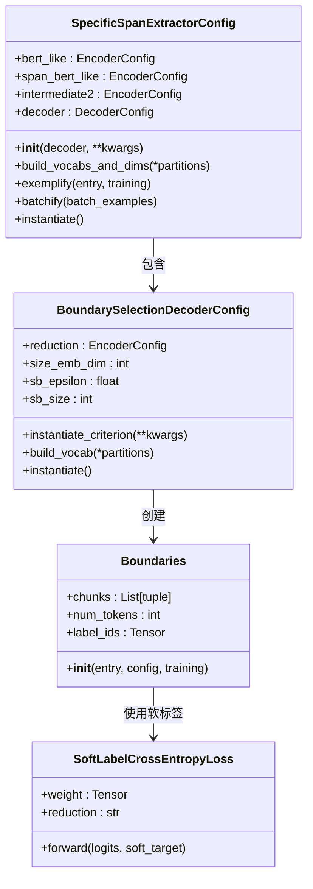

# 边界平滑

<cite>
**本文档引用的文件**   
- [boundary-smoothing_zh.md](file://docs/boundary-smoothing_zh.md)
- [boundary-smoothing.md](file://docs/boundary-smoothing.md)
- [specific_span_extractor.py](file://eznlp/model/model/specific_span_extractor.py)
- [boundary_selection.py](file://eznlp/model/decoder/boundary_selection.py)
- [boundaries.py](file://eznlp/model/decoder/boundaries.py)
- [entity_recognition.py](file://scripts/entity_recognition.py)
- [loss.py](file://eznlp/nn/modules/loss.py)
- [functional.py](file://eznlp/nn/functional.py)
</cite>

## 目录
1. [引言](#引言)
2. [边界平滑技术原理](#边界平滑技术原理)
3. [核心参数详解](#核心参数详解)
4. [中英文数据集配置示例](#中英文数据集配置示例)
5. [解码器中的集成实现](#解码器中的集成实现)
6. [调参建议与性能权衡](#调参建议与性能权衡)
7. [结论](#结论)

## 引言

边界平滑（Boundary Smoothing）是一种用于命名实体识别（NER）任务的先进技术，旨在解决实体边界模糊和嵌套实体识别的难题。在实际文本中，命名实体的边界往往不明确，存在多种可能的切分方式，这给传统的硬标签分类方法带来了挑战。边界平滑技术通过引入软标签（soft label）机制，将原本非此即彼的硬性边界判断转化为一种概率分布，从而让模型能够学习到边界附近的不确定性，提升对模糊边界的识别能力。

该技术特别适用于处理嵌套实体（nested entities）和边界不明确的复杂场景。通过在训练过程中对边界标签进行平滑处理，模型不仅关注精确匹配的实体，还能从边界附近的“近似正确”样本中学习，从而增强了模型的鲁棒性和泛化能力。本文档将深入探讨边界平滑技术的实现细节，重点分析其核心参数 `sb_epsilon` 和 `sb_size` 的作用，并结合代码示例说明其在中英文数据集上的配置方法。

**Section sources**
- [boundary-smoothing_zh.md](file://docs/boundary-smoothing_zh.md#L1-L74)
- [boundary-smoothing.md](file://docs/boundary-smoothing.md#L1-L79)

## 边界平滑技术原理

边界平滑技术的核心思想是将命名实体识别任务中的边界标签从传统的“硬标签”（hard label）转变为“软标签”（soft label）。在标准的边界选择（Boundary Selection）解码器中，模型会为文本中每一个可能的起始-结束位置对（span）预测一个类别标签。对于一个真实的实体 `[PER] John Smith [/PER]`，其对应的标签是精确的：只有起始位置为“John”的索引、结束位置为“Smith”之后索引的那一个span，其标签为“PER”，而所有其他span的标签均为“<none>”。

边界平滑技术打破了这种绝对的二元划分。它通过参数 `sb_epsilon` 和 `sb_size`，将一部分标签概率从精确的实体边界“泄漏”到其周围的邻近边界上。具体来说，对于一个真实实体，其精确边界的标签概率会从1.0降低到 `1 - sb_epsilon`，而 `sb_epsilon` 这部分概率会被均匀地分配给距离该实体边界 `sb_size` 范围内的所有邻近span。例如，如果 `sb_size=1`，则“John Smith”实体的标签概率会部分分配给“John”、“Smith”以及“John Smith X”等邻近的span。

这种软标签机制的实现主要在 `Boundaries` 类中完成。当 `sb_epsilon > 0` 时，`Boundaries` 对象在初始化时不会创建一个 `long` 类型的硬标签张量，而是创建一个 `float` 类型的软标签张量 `label_ids`。该张量的维度为 `(seq_len, seq_len, voc_dim)`，其中每个位置存储的是一个概率分布。代码通过 `_spans_from_surrounding` 函数生成所有邻近的span，并根据距离远近按比例分配平滑概率。这种方法使得模型在训练时，即使预测的边界与真实边界有微小偏差，也不会受到严厉的惩罚，而是被视为一种“部分正确”的预测，从而鼓励模型学习到更灵活的边界判断能力。

**Section sources**
- [boundaries.py](file://eznlp/model/decoder/boundaries.py#L183-L218)
- [boundary_selection.py](file://eznlp/model/decoder/boundary_selection.py#L123-L125)

## 核心参数详解

边界平滑技术的性能和效果主要由两个核心参数控制：`sb_epsilon` 和 `sb_size`。这两个参数共同定义了软标签的“平滑程度”和“影响范围”。

### sb_epsilon 参数

`sb_epsilon` 参数（全称：smoothing boundary epsilon）是一个浮点数，取值范围在0.0到1.0之间，它决定了从精确边界“泄漏”出去的总概率质量。当 `sb_epsilon=0.0` 时，边界平滑功能被完全关闭，模型退化为传统的硬标签训练模式。随着 `sb_epsilon` 值的增大，模型对边界模糊的容忍度也随之提高。

例如，当 `sb_epsilon=0.2` 时，意味着真实实体精确边界的标签概率被降低到0.8，而有0.2的概率被分配给周围的邻近边界。这个值的选择需要权衡：过小的 `sb_epsilon` 无法有效缓解边界模糊问题；而过大的 `sb_epsilon` 则可能导致模型过于“宽容”，将错误的边界也视为可接受的，从而降低整体的精确度。通常，`sb_epsilon` 的取值在0.1到0.3之间，需要根据具体数据集的边界模糊程度进行调整。

### sb_size 参数

`sb_size` 参数（全称：smoothing boundary size）是一个整数，它定义了平滑操作的影响范围，即从真实实体边界向外扩展的“窗口大小”。例如，当 `sb_size=1` 时，平滑操作只影响那些起始或结束位置与真实边界相差1个token的邻近span。当 `sb_size=2` 时，影响范围扩大到相差2个token的span。

`sb_size` 的选择直接影响了模型学习的“粒度”。较小的 `sb_size`（如1）意味着模型只对非常接近真实边界的预测给予奖励，这有助于保持较高的精确度。较大的 `sb_size`（如2）则允许更宽松的边界判断，可能对处理长实体或边界极其模糊的实体更有利，但同样可能引入更多的噪声。在实践中，`sb_size` 通常设置为1或2，`sb_size=1` 是一个较为常见和稳健的选择。

这两个参数在 `BoundarySelectionDecoderConfig` 类的 `__init__` 方法中被定义，并通过 `criterion` 属性反映在模型的损失函数名称中，例如 `SB(0.1, 1)` 表示使用了 `sb_epsilon=0.1` 和 `sb_size=1` 的边界平滑。

**Section sources**
- [boundary_selection.py](file://eznlp/model/decoder/boundary_selection.py#L124-L125)
- [boundary_selection.py](file://eznlp/model/decoder/boundary_selection.py#L150-L153)
- [entity_recognition.py](file://scripts/entity_recognition.py#L233-L237)

## 中英文数据集配置示例

在 `eznlp` 框架中，边界平滑技术的配置非常直观，主要通过命令行参数来实现。以下是在中英文数据集上启用边界平滑的具体命令示例。

### 英文数据集配置

对于英文数据集，如CoNLL 2003、OntoNotes 5等，可以使用以下命令行模板来启用边界平滑：

```bash
$ python scripts/entity_recognition.py @scripts/options/with_bert.opt \
    --num_epochs 50 \
    --batch_size 48 \
    --num_grad_acc_steps 1 \
    --dataset conll2003 \
    --ck_decoder boundary_selection \
    --sb_epsilon 0.1 \
    --sb_size 1 \
    --bert_arch RoBERTa_base \
    --use_interm2
```

在这个命令中，`--ck_decoder boundary_selection` 指定了使用边界选择解码器，这是应用边界平滑的前提。`--sb_epsilon 0.1` 和 `--sb_size 1` 则分别设置了平滑的强度和范围。用户可以根据实验需求，将 `sb_epsilon` 替换为0.0、0.2或0.3，将 `sb_size` 替换为2，以探索不同的配置组合。

### 中文数据集配置

对于中文数据集，如MSRA、WeiboNER等，配置方法与英文数据集类似，主要区别在于预训练模型的选择：

```bash
$ python scripts/entity_recognition.py @scripts/options/with_bert.opt \
    --num_epochs 50 \
    --batch_size 48 \
    --num_grad_acc_steps 1 \
    --dataset WeiboNER \
    --ck_decoder boundary_selection \
    --sb_epsilon 0.2 \
    --sb_size 1 \
    --bert_arch MacBERT_base \
    --use_interm2
```

这里使用了 `MacBERT_base` 作为中文预训练模型。同样，`--sb_epsilon` 和 `--sb_size` 参数的设置方式与英文数据集完全相同。这表明边界平滑技术是一种与语言无关的通用方法，可以无缝地应用于不同语言的NER任务中。

**Section sources**
- [boundary-smoothing_zh.md](file://docs/boundary-smoothing_zh.md#L40-L68)
- [boundary-smoothing.md](file://docs/boundary-smoothing.md#L41-L71)

## 解码器中的集成实现

边界平滑技术在 `eznlp` 框架中的集成主要体现在 `SpecificSpanExtractorConfig` 类中，该类负责构建整个命名实体识别模型的配置。

### 配置类集成

`SpecificSpanExtractorConfig` 类是模型配置的顶层设计。它通过 `decoder` 参数接收一个解码器配置对象，例如 `BoundarySelectionDecoderConfig`。当用户在命令行中指定 `--sb_epsilon` 和 `--sb_size` 时，这些参数会首先被传递给 `build_ER_config` 函数，该函数根据 `--ck_decoder` 的类型创建相应的解码器配置。对于 `boundary_selection` 解码器，会创建一个 `BoundarySelectionDecoderConfig` 实例，并将 `sb_epsilon` 和 `sb_size` 作为其初始化参数。

随后，这个配置好的解码器对象会被传递给 `SpecificSpanExtractorConfig` 的构造函数。在 `SpecificSpanExtractorConfig` 的 `__init__` 方法中，它会检查传入的 `decoder` 参数，并将其赋值给自身的 `self.decoder` 属性。这样，边界平滑的配置信息就从命令行参数，经过解码器配置，最终被整合到了顶层的模型配置中。

### 模型实例化

当调用 `config.instantiate()` 方法时，`SpecificSpanExtractorConfig` 会创建一个 `SpecificSpanExtractor` 模型实例。该模型的 `forward2states` 方法负责执行前向传播，生成用于解码的隐藏状态。在这个过程中，模型会调用 `self.decoder` 的 `forward` 方法来计算损失。由于 `self.decoder` 是一个已经配置了边界平滑的 `BoundarySelectionDecoder` 实例，因此在计算损失时，它会使用 `SoftLabelCrossEntropyLoss` 损失函数来处理 `Boundaries` 类生成的软标签张量，从而完整地实现了边界平滑的训练流程。



**Diagram sources**
- [specific_span_extractor.py](file://eznlp/model/model/specific_span_extractor.py#L20-L111)
- [boundary_selection.py](file://eznlp/model/decoder/boundary_selection.py#L92-L198)
- [boundaries.py](file://eznlp/model/decoder/boundaries.py#L108-L234)
- [loss.py](file://eznlp/nn/modules/loss.py#L11-L27)

**Section sources**
- [specific_span_extractor.py](file://eznlp/model/model/specific_span_extractor.py#L20-L111)
- [entity_recognition.py](file://scripts/entity_recognition.py#L587-L596)

## 调参建议与性能权衡

在实际应用边界平滑技术时，合理的调参策略对于获得最佳性能至关重要。以下是一些基于代码实现和实践经验的建议。

### 参数选择策略

1.  **从保守开始**：建议从较小的 `sb_epsilon` 值（如0.1）和 `sb_size=1` 开始实验。这是一个相对保守的设置，可以在缓解边界模糊的同时，最大限度地减少对模型精确度的负面影响。
2.  **逐步调整**：如果发现模型在验证集上的召回率较低，且存在大量边界预测偏差1-2个token的错误，可以尝试逐步增加 `sb_epsilon` 到0.2或0.3，或者将 `sb_size` 增加到2。
3.  **考虑数据集特性**：对于边界定义非常清晰的数据集（如MSRA），可能不需要或只需要很小的 `sb_epsilon`。而对于社交媒体文本（如WeiboNER），由于语言表达的随意性，边界模糊问题更严重，可以尝试使用更大的平滑参数。

### 性能权衡分析

边界平滑技术本质上是在**精确度（Precision）** 和**召回率（Recall）** 之间进行权衡。其主要影响如下：

-   **正面影响**：
    -   **提升召回率**：通过将邻近边界的预测视为“部分正确”，模型更倾向于预测出实体，即使边界不完全精确，从而提高了召回率。
    -   **增强鲁棒性**：模型对标注噪声和边界模糊的容忍度提高，训练过程更加稳定。

-   **负面影响**：
    -   **可能降低精确度**：过度的平滑可能会导致模型将一些错误的边界也预测为实体，从而引入更多的假阳性（False Positives），降低精确度。
    -   **增加训练复杂度**：软标签的计算比硬标签更复杂，会略微增加数据预处理的开销。

因此，最佳的 `sb_epsilon` 和 `sb_size` 组合是能够最大化F1分数（精确率和召回率的调和平均数）的组合。用户应通过在验证集上进行网格搜索（grid search）或随机搜索（random search），系统地评估不同参数组合的性能，以找到最优配置。

**Section sources**
- [test_boundary_selection.py](file://tests/model/test_boundary_selection.py#L57-L68)
- [boundary_selection.py](file://eznlp/model/decoder/boundary_selection.py#L124-L125)

## 结论

边界平滑技术是一种有效解决命名实体识别中边界模糊问题的创新方法。通过引入软标签机制，它允许模型在训练过程中学习到边界的不确定性，从而提升了对嵌套实体和不明确边界的识别能力。`sb_epsilon` 和 `sb_size` 两个核心参数为该技术提供了灵活的控制手段，用户可以根据具体任务的需求调整平滑的强度和范围。

在 `eznlp` 框架中，该技术的实现清晰且易于配置，通过简单的命令行参数即可在中英文数据集上启用。尽管边界平滑在提升召回率方面表现出色，但也需要注意其可能对精确度带来的负面影响。因此，在实际应用中，应通过严谨的实验和调参，找到精确度与召回率之间的最佳平衡点，以充分发挥该技术的潜力。