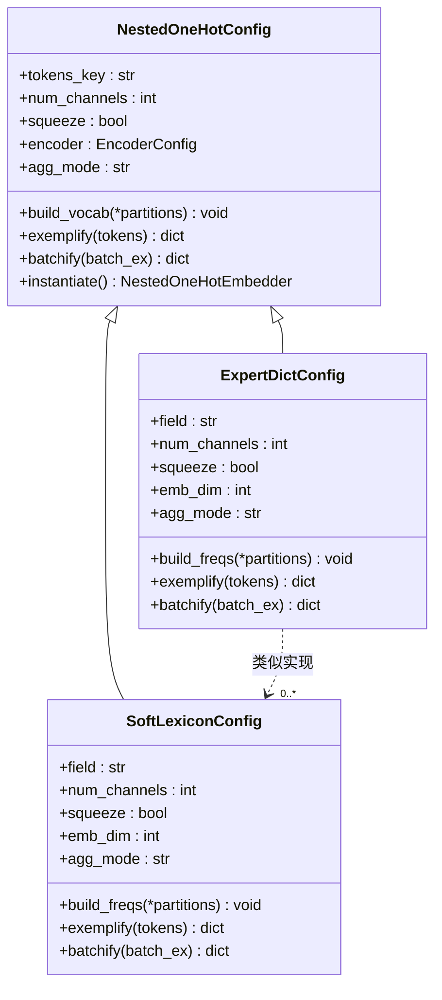
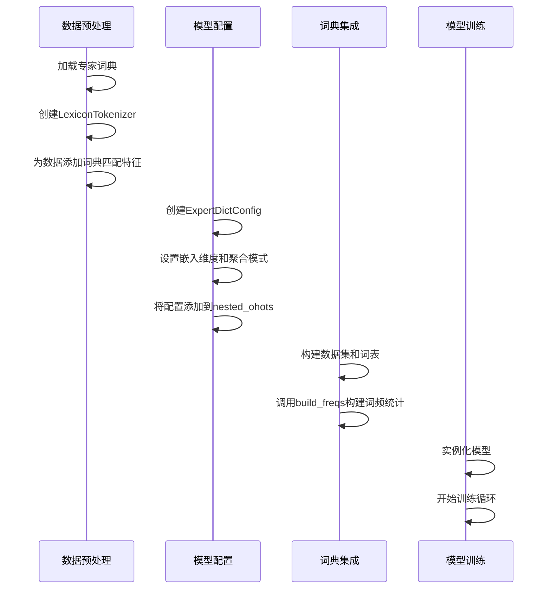

# 高级功能

<cite>
**本文档引用的文件**   
- [hz_ner_with_expert_dict.py](file://examples/hz_ner_with_expert_dict.py)
- [convert_entity_to_lexicon.py](file://scripts/convert_entity_to_lexicon.py)
- [boundary-smoothing_zh.md](file://docs/boundary-smoothing_zh.md)
- [deep-span.md](file://docs/deep-span.md)
- [nested_embedder.py](file://eznlp/model/nested_embedder.py)
- [span_bert_like.py](file://eznlp/model/span_bert_like.py)
</cite>

## 目录
1. [引言](#引言)
2. [边界平滑技术](#边界平滑技术)
3. [Deep-Span架构](#deep-span架构)
4. [专家词典集成](#专家词典集成)
5. [词典提取与配置](#词典提取与配置)
6. [性能影响与适用场景](#性能影响与适用场景)

## 引言
eznlp框架提供了一系列高级特性，旨在提升中文命名实体识别（NER）的性能，特别是在处理嵌套实体和模糊边界问题方面。本文档深入探讨了三种核心技术：边界平滑（boundary smoothing）、Deep-Span架构和专家词典集成。这些技术通过不同的机制增强模型对实体边界的识别能力，提高对复杂文本结构的处理效果。通过结合预训练语言模型和领域知识，eznlp能够有效应对中文NER中的挑战，如实体边界不清晰、嵌套实体识别困难等问题。

## 边界平滑技术
边界平滑技术是一种用于改善命名实体识别中边界预测准确性的方法。该技术通过在训练过程中引入标签平滑机制，减少模型对边界标签的过度自信，从而提高对模糊边界的鲁棒性。在eznlp中，边界平滑通过`--sb_epsilon`参数控制平滑程度，取值范围为0.0到0.3。当`sb_epsilon`设置为0.0时，表示不使用边界平滑；随着值的增加，平滑效果增强。该技术特别适用于处理中文文本中常见的边界模糊问题，如实体边界不明确或存在多种可能的切分方式。通过调整`--sb_size`参数（可选值为1或2），可以控制平滑的窗口大小，进一步优化模型性能。

**Section sources**
- [boundary-smoothing_zh.md](file://docs/boundary-smoothing_zh.md#L48-L49)
- [test_boundary_selection.py](file://tests/model/test_boundary_selection.py#L74-L76)

## Deep-Span架构
Deep-Span架构是一种基于跨度的深度学习模型，专门设计用于处理命名实体识别任务。该架构通过显式地建模文本中的所有可能跨度，能够有效识别嵌套实体和复杂实体结构。在eznlp中，Deep-Span架构通过`--ck_decoder specific_span`参数启用，并结合`--sse_max_span_size`参数控制最大跨度大小（可选值为10、15、20或25）。该架构利用预训练语言模型（如BERT或RoBERTa）作为编码器，通过深度跨度表示来捕捉实体的语义信息。模型通过计算每个可能跨度的表示，并使用分类器判断其是否为实体，从而实现对文本中所有潜在实体的全面扫描。这种架构特别适合处理包含多层嵌套实体的复杂文本。

**Section sources**
- [deep-span.md](file://docs/deep-span.md#L54-L59)
- [span_bert_like.py](file://eznlp/model/span_bert_like.py#L26-L28)

## 专家词典集成
专家词典集成是eznlp框架中的一项重要特性，旨在通过引入领域特定的专家知识来增强NER模型的性能。该技术通过将专家词典作为额外的特征输入到模型中，为模型提供关于实体边界的先验知识。在eznlp中，专家词典集成通过`ExpertDictConfig`类实现，该类继承自`NestedOneHotConfig`，专门用于处理专家词典特征。词典特征通过`nested_ohots`字段添加到模型配置中，与BERT等预训练模型特征进行融合。该技术特别适用于专业领域文本（如医疗、法律等），其中包含大量领域特定术语，通过专家词典可以显著提高这些术语的识别准确率。

**Diagram sources**
- [nested_embedder.py](file://eznlp/model/nested_embedder.py#L214-L264)
- [hz_ner_with_expert_dict.py](file://examples/hz_ner_with_expert_dict.py#L98-L101)

## 词典提取与配置
### 词典提取流程
从训练数据中提取专家词典是一个关键步骤，eznlp提供了`convert_entity_to_lexicon.py`脚本自动化这一过程。该脚本从包含实体标注的训练数据中提取所有实体，经过去重和排序后生成专家词典文件。提取过程包括解析实体列表文件、识别各类别实体、去除重复项并保存为每行一个词条的格式。该流程确保了词典的完整性和规范性，为后续的模型训练提供高质量的领域知识。

**Section sources**
- [convert_entity_to_lexicon.py](file://scripts/convert_entity_to_lexicon.py#L13-L34)
- [extract_lexicon_from_training.py](file://scripts/extract_lexicon_from_training.py#L108-L120)

### 模型配置与集成
在模型配置中启用软词典嵌入需要通过`ExpertDictConfig`类进行设置。该配置包括词典特征嵌入维度（`emb_dim`）和聚合模式（`agg_mode`）等参数。在`hz_ner_with_expert_dict.py`示例中，通过将`ExpertDictConfig`实例添加到`ExtractorConfig`的`nested_ohots`字段中，实现了专家词典特征的集成。模型在训练前会构建词频统计，通过`build_freqs`方法从训练和验证数据中收集频率信息，用于加权平均池化。这种配置方式使得模型能够动态调整词典特征的权重，提高对高频实体的识别能力。

**Diagram sources**
- [hz_ner_with_expert_dict.py](file://examples/hz_ner_with_expert_dict.py#L53-L83)
- [nested_embedder.py](file://eznlp/model/nested_embedder.py#L175-L191)

## 性能影响与适用场景
### 性能影响分析
边界平滑、Deep-Span架构和专家词典集成对模型性能有显著影响。边界平滑通过减少过拟合，提高了模型对边界模糊实体的识别能力，但可能略微增加训练时间。Deep-Span架构由于需要处理所有可能跨度，计算复杂度较高，但能有效识别嵌套实体，特别适合处理复杂文本结构。专家词典集成通过引入领域知识，显著提高了特定领域术语的识别准确率，但需要高质量的专家词典支持。综合使用这些技术可以在保持较高精度的同时，有效处理中文NER中的各种挑战。

**Section sources**
- [boundary-smoothing_zh.md](file://docs/boundary-smoothing_zh.md#L48-L49)
- [deep-span.md](file://docs/deep-span.md#L54-L59)
- [nested_embedder.py](file://eznlp/model/nested_embedder.py#L160-L167)

### 适用场景建议
这些高级特性适用于不同的应用场景。边界平滑适合处理边界模糊的通用文本，如社交媒体内容或非正式文本。Deep-Span架构特别适用于需要识别嵌套实体的专业文档，如法律文书或医学报告。专家词典集成最适合领域特定的NER任务，如生物医学文献中的基因和蛋白质识别，或金融文档中的公司和产品识别。在实际应用中，建议根据具体任务需求选择合适的组合：对于通用文本，可使用边界平滑；对于复杂结构文本，应采用Deep-Span架构；对于专业领域文本，则应结合专家词典集成以获得最佳效果。

**Section sources**
- [hz_ner_with_expert_dict.py](file://examples/hz_ner_with_expert_dict.py#L98-L101)
- [deep-span.md](file://docs/deep-span.md#L54-L59)
- [boundary-smoothing_zh.md](file://docs/boundary-smoothing_zh.md#L48-L49)