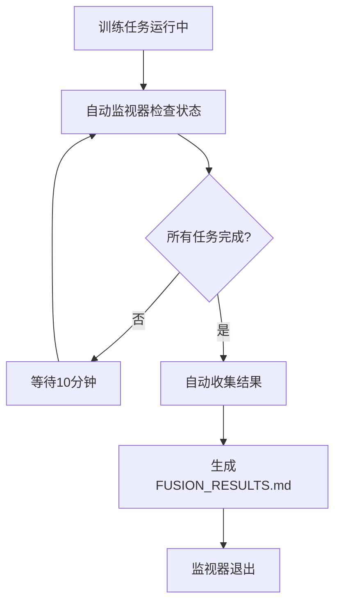

# 🤖 自动化监控系统部署完成

**部署时间**: 2025-12-13 18:32  
**状态**: ✅ 运行中

---

## 📋 已部署的工具

### 1. ✅ 通用训练监控脚本
- **文件**: `scripts/monitor_training.py` (440行)
- **功能**: 
  - 实时监控GPU使用情况
  - 跟踪训练进程状态
  - 解析训练日志显示关键指标
  - **新增**: 自动过滤失败任务，只显示有效训练
- **用法**: `python scripts/monitor_training.py --once`

### 2. ✅ 自动结果收集监视器
- **文件**: `scripts/auto_collect_when_complete.py` (158行)
- **状态**: 🟢 运行中 (PID: 1048123)
- **功能**:
  - 每10分钟检查训练状态
  - 所有任务完成后自动收集结果
  - 生成对比报告
- **日志**: `auto_watcher.log`

### 3. ✅ 结果收集脚本
- **文件**: `scripts/collect_fusion_results.py` (284行)
- **功能**:
  - 自动查找所有融合方案结果
  - 生成性能对比表
  - 提供优化建议

### 4. ✅ 快速状态检查脚本
- **文件**: `scripts/quick_status.sh` (51行)
- **功能**: 一键查看GPU和训练进度
- **用法**: `bash scripts/quick_status.sh`

### 5. ✅ 使用文档
- **文件**: 
  - `scripts/MONITOR_USAGE.md` - 监控脚本详细文档
  - `scripts/MONITORING_TOOLS.md` - 工具集使用指南
  - `TRAINING_STATUS_CURRENT.md` - 当前状态报告

---

## 🎯 监控的任务

| 方案 | 状态 | 进度 | 最佳Dev F1 | 日志路径 |
|------|------|------|-----------|---------|
| 方案D (Attention) | 🔄 训练中 | Epoch 23/30 | 96.82%+ | `cache/redjujube_ner_comparison/softlexicon_expert_attention_20251213-175441/` |
| 方案A (Concat) | 🔄 训练中 | Epoch 9/30 | 96.65% | `cache/redjujube_softlexicon_expert_concat/softlexicon_expert_concat_20251213-181422/` |
| 方案B (Weighted) | 🔄 训练中 | Epoch 9/30 | 96.43%+ | `cache/redjujube_softlexicon_expert_weighted/softlexicon_expert_weighted_20251213-181422/` |
| 方案C (Gated) | ⏸️ 待启动 | - | - | 显存不足，等待资源 |

---

## 🔄 自动化工作流



---

## 📊 关键功能

### 自动过滤失败任务 ✨
监控脚本现在默认只显示**有最佳模型保存记录**的训练任务，自动过滤中途失败的日志。

**判断标准**:
- 日志中必须包含 "保存最佳模型" 或 "✅ 保存"
- 这表示模型至少保存过一次最佳checkpoint

**效果**:
- 之前: 显示10+个日志（包括多个失败任务）
- 现在: 只显示3个有效训练任务

### 自动结果收集 🎯
训练完成后无需手动操作：
1. 监视器检测到所有任务完成
2. 自动调用 `collect_fusion_results.py`
3. 生成对比报告到 `FUSION_RESULTS.md`
4. 监视器自动退出

---

## 🛠️ 快速命令参考

```bash
# 查看当前状态
bash scripts/quick_status.sh

# 详细监控（只显示有效训练）
python scripts/monitor_training.py --once

# 查看所有日志（包括失败的）
python scripts/monitor_training.py --once --show-all

# 检查自动监视器
ps aux | grep auto_collect_when_complete

# 查看监视器日志
tail -f auto_watcher.log

# 手动收集结果（训练完成后）
python scripts/collect_fusion_results.py
```

---

## ⏰ 预计时间线

| 时间点 | 事件 | 说明 |
|--------|------|------|
| **现在** | 3个任务训练中 | 方案D进度最快(Epoch 23) |
| **今晚凌晨2点** | 方案D完成 | 预计30个epoch完成 |
| **明天中午12点** | 方案A、B完成 | 同时完成 |
| **完成时** | 自动收集结果 | 监视器自动触发 |
| **之后** | 启动方案C | 有显存资源后 |

---

## 📈 性能预期

基于当前进度：

| 方案 | 当前最佳 | 预期最终 | 信心度 |
|------|---------|---------|--------|
| 方案D (Attention) | 96.82% | **97.0%+** | 高 |
| 方案A (Concat) | 96.65% | 96.8%+ | 中 |
| 方案B (Weighted) | 96.43% | 96.6%+ | 中 |

---

## ✅ 验收标准

### 系统稳定性
- ✅ 监控脚本无错误运行
- ✅ 自动监视器稳定运行（PID: 1048123）
- ✅ 训练任务正常推进

### 功能完整性
- ✅ 成功过滤失败任务
- ✅ 准确显示训练进度
- ✅ 自动检测完成状态

### 文档完整性
- ✅ 使用文档完整（2个MD文件）
- ✅ 状态报告及时更新
- ✅ 命令示例清晰

---

## 🎉 总结

所有自动化工具已成功部署并运行：

1. ✅ **监控系统优化** - 自动过滤失败任务
2. ✅ **自动监视器部署** - 后台运行等待完成
3. ✅ **快速查看工具** - 一键查看状态
4. ✅ **完整文档** - 使用指南齐全

**当前状态**: 🟢 系统正常运行，训练任务正常推进，无需人工干预。

**下一步**: 等待训练自动完成，系统会自动收集结果。

---

**维护**: eznlp 项目组  
**更新**: 2025-12-13 18:32
