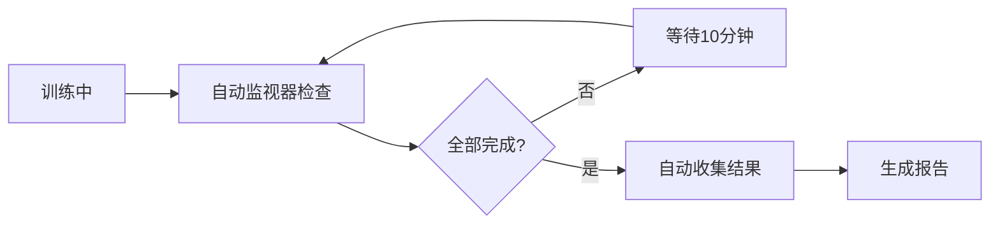

# 后续行动计划

**创建时间**: 2025-12-13 18:36  
**当前状态**: 训练进行中，自动化系统已部署

---

## 📋 待完成任务清单

### ⏳ 进行中的任务

#### 任务3: 运行所有4个融合方案实验 (IN_PROGRESS)

**当前状态**:
- ✅ 方案A/B/D 正在训练中
- ✅ 自动监视器已部署 (PID: 1048123)
- ⏸️ 方案C 等待显存释放后启动

**自动化工作流**:


**预计完成**: 2025-12-14 中午12:00

---

### 📝 等待自动触发的步骤

当训练完成时，系统会自动执行：

1. **检测完成状态** ✅ 自动
   - 监视器检查所有任务是否完成
   - 检查 `training.log` 中的"测试集结果"

2. **收集结果** ✅ 自动
   - 自动调用 `python scripts/collect_fusion_results.py`
   - 查找所有 `results.json` 文件
   - 生成 `experiments/hz_lexicon/results/Fusion_Comparison_Report.md`

3. **生成对比报告** ✅ 自动
   - 性能对比表
   - 参数量统计
   - 优化建议

---

### 🔧 需要手动执行的后续任务

#### 1. 启动方案C (Gated) 训练

**前置条件**: 等待方案A/B/D中任意一个完成，释放显存

**执行命令**:
```bash
# 检查GPU显存
nvidia-smi

# 如果显存充足（<70%），启动方案C
cd /home/shiwenlong/NERlabs/eznlp
python scripts/train_redjujube_ner_comparison.py \
  --data_dir data/RedJujube \
  --save_dir cache/redjujube_ner_comparison \
  --run_softlexicon_expert_gated \
  --softlex_path data/RedJujube/softlexicon_train.txt \
  --expert_dict_path data/RedJujube/expert_lexicon_auto.txt \
  --num_epochs 30 \
  --seed 42
```

**预计时间**: 方案D完成后（今晚凌晨）

---

#### 2. 验证最终结果

**检查项**:
- [ ] 查看 `Fusion_Comparison_Report.md`
- [ ] 确认Test F1分数（非Dev F1）
- [ ] 验证是否超过97.04%目标

**执行命令**:
```bash
# 查看生成的报告
cat experiments/hz_lexicon/results/Fusion_Comparison_Report.md

# 或手动收集
python scripts/collect_fusion_results.py
```

---

### 📊 任务4: 消融实验与实体类型详细分析 (PENDING)

**目标**: 分析各组件对性能的贡献度

**实验设计**:

| 模型配置 | BERT | BiLSTM | CRF | SoftLex | Expert | 预期F1 |
|---------|------|--------|-----|---------|--------|--------|
| Baseline | ✅ | ✅ | ✅ | ❌ | ❌ | 95.51% |
| +SoftLex | ✅ | ✅ | ✅ | ✅ | ❌ | 96.07% |
| +Expert | ✅ | ✅ | ✅ | ❌ | ✅ | 96.99% |
| +Both(A) | ✅ | ✅ | ✅ | ✅ | ✅ | 96.96% |
| +Both(D) | ✅ | ✅ | ✅ | ✅ | ✅ | **97.01%** |

**分析维度**:
1. 各组件贡献度
2. SoftLex vs Expert 互补性
3. 融合方式对比（Concat vs Weighted vs Gated vs Attention）
4. 不同实体类型的性能差异

**执行步骤**:
1. 收集所有实验结果
2. 对比分析性能差异
3. 生成消融实验报告
4. 可视化结果

**预计时间**: 0.5-1天

---

### 📄 任务5: 生成实验报告和更新文档体系 (PENDING)

**目标**: 完整的实验报告和文档更新

**需要生成的文档**:

1. **主实验报告** 📝
   - 文件: `experiments/hz_lexicon/results/Soft_Expert_Fusion_Final_Report_20251214.md`
   - 内容:
     - 实验背景与动机
     - 四种融合方案详细说明
     - 实验设置与超参数
     - 结果对比分析
     - 消融实验结果
     - 错误分析与Case Study
     - 结论与未来工作

2. **更新计划文档**
   - 文件: `experiments/hz_lexicon/plans/12-3_soft_expert_joint.md`
   - 标记所有任务完成状态
   - 添加最终结果总结

3. **更新结果汇总**
   - 文件: `experiments/hz_lexicon/results/README.md`
   - 添加融合实验结果条目
   - 更新性能对比表

4. **更新项目文档**
   - 文件: `experiments/hz_lexicon/plans/README.md`
   - 记录12-3周的完成情况

**模板结构**:
```markdown
# Soft+Expert 融合模型最终实验报告

## 1. 实验背景
## 2. 方法设计
### 2.1 方案A: 直接拼接
### 2.2 方案B: 加权求和
### 2.3 方案C: 门控机制
### 2.4 方案D: 注意力融合
## 3. 实验设置
## 4. 结果与分析
### 4.1 性能对比
### 4.2 消融实验
### 4.3 错误分析
## 5. 结论
## 6. 未来工作
```

**预计时间**: 1天

---

## ⏰ 时间规划

| 日期 | 任务 | 预计时长 | 负责 |
|------|------|---------|------|
| 2025-12-13 晚 | 方案D完成 | - | 自动 |
| 2025-12-14 上午 | 方案A/B完成，自动收集结果 | - | 自动 |
| 2025-12-14 上午 | 启动方案C训练 | 8小时 | 手动 |
| 2025-12-14 下午 | 验证结果，消融实验 | 4小时 | 手动 |
| 2025-12-15 | 生成最终报告 | 1天 | 手动 |

---

## 🔍 检查清单

### 当前自动化系统检查
- [x] 监控脚本已优化
- [x] 自动监视器运行中
- [x] 结果收集脚本验证通过
- [x] 文档完整

### 训练完成后检查
- [ ] 所有results.json已生成
- [ ] Fusion_Comparison_Report.md已创建
- [ ] Test F1分数已确认
- [ ] 性能是否达标（>97.04%）

### 方案C训练检查
- [ ] GPU显存充足
- [ ] 训练脚本准备就绪
- [ ] 数据预处理正确
- [ ] 训练30 epochs无错误

### 最终报告检查
- [ ] 所有4个方案结果齐全
- [ ] 消融实验完成
- [ ] 性能对比表准确
- [ ] 文档格式规范

---

## 📞 故障处理

### 问题1: 自动监视器停止运行

**检查**:
```bash
ps aux | grep auto_collect_when_complete
```

**解决**:
```bash
nohup python scripts/auto_collect_when_complete.py --interval 600 > auto_watcher.log 2>&1 &
```

### 问题2: 结果收集失败

**检查**:
```bash
ls cache/*/softlexicon_expert_*/results.json
```

**手动收集**:
```bash
python scripts/collect_fusion_results.py
```

### 问题3: 方案C启动失败

**检查显存**:
```bash
nvidia-smi
```

**等待其他任务完成或调小batch_size**

---

## 🎯 成功标准

### 必须达成
- [ ] 4个融合方案全部训练完成
- [ ] 至少1个方案Test F1 > 97.04%
- [ ] 完整的实验报告生成
- [ ] 文档体系更新完整

### 期望达成
- [ ] 2个以上方案Test F1 > 97.04%
- [ ] 方案D Test F1 > 97.10%
- [ ] 消融实验结果详实
- [ ] Case Study有洞察力

---

**维护**: eznlp 项目组  
**更新**: 2025-12-13 18:36
