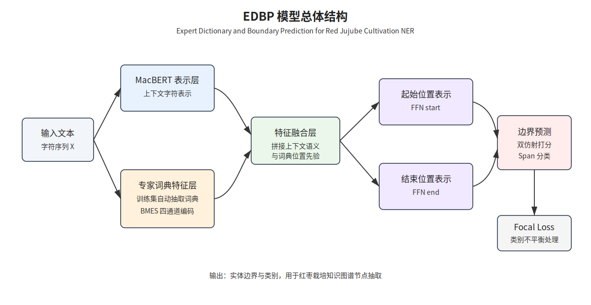
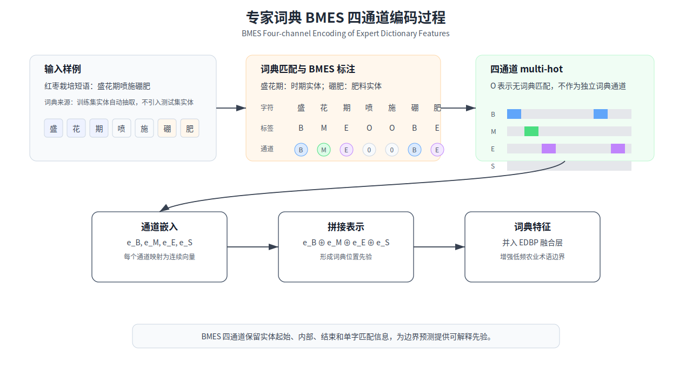
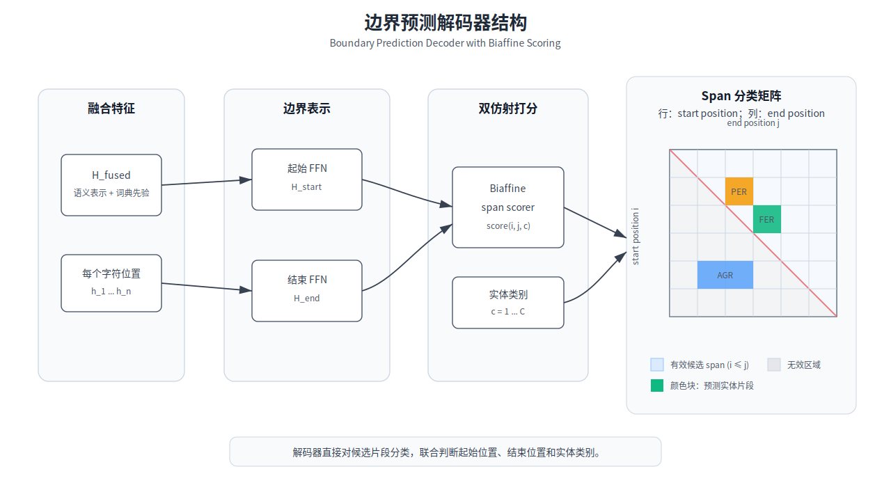
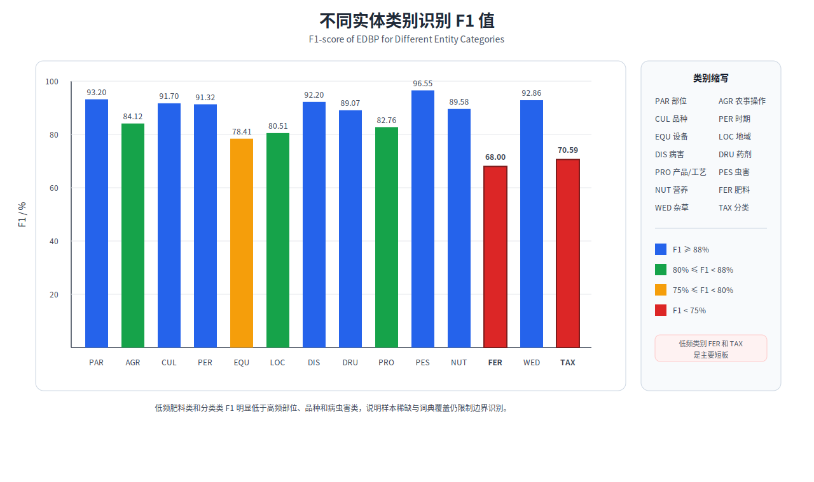

# 基于专家词典与边界预测的红枣栽培命名实体识别方法

## 摘要

针对红枣栽培技术文本中领域术语密集、实体类别分布不均衡和传统序列标注解码器难以全局判断实体边界等问题，提出一种基于专家词典与边界预测的红枣栽培命名实体识别方法（Expert Dictionary and Boundary Prediction，EDBP）。围绕红枣栽培品种、部位、病虫害、药剂、农事操作等关键知识单元，构建涵盖 14 个实体类别的红枣栽培命名实体识别数据集 RJND；从训练集自动抽取领域实体构建专家词典，采用 BMES 四通道结构编码词典匹配位置，将领域词典先验融合到字符语义表示中；将命名实体识别建模为片段分类任务，采用边界预测解码器对候选实体起止位置进行联合打分，并引入 Focal Loss 缓解类别不平衡对低频实体识别的影响。结果表明，EDBP 在 RJND 数据集上的 F1 值达到 88.16%，较 BiLSTM-CRF、BERT-wwm-ext+BiLSTM+CRF、MacBERT-base+BiLSTM+CRF、SoftLexicon、FLAT 和 FLAT+BERT 分别提升 9.86、2.95、2.80、3.41、8.38 和 8.76 个百分点；在 MSRA、WeiboNER、ResumeNER、Boson 和 CLUENER 公开数据集上的 F1 值分别为 95.19%±0.22%、72.27%±1.03%、96.13%±0.29%、85.60%±0.12% 和 80.06%±0.38%。研究表明，专家词典特征与边界预测解码器能够有效提升红枣栽培领域实体识别精度，可为红枣栽培知识图谱构建、农业技术智能检索和问答系统提供基础支撑。

关键词：红枣栽培；命名实体识别；专家词典；边界预测；Focal Loss；农业知识图谱

## Abstract

To address the problems of dense domain-specific terminology, imbalanced entity categories, and insufficient global boundary modeling in named entity recognition for red jujube cultivation texts, an Expert Dictionary and Boundary Prediction method, named EDBP, was proposed. First, a red jujube cultivation named entity recognition dataset, RJND, was constructed around key knowledge units such as cultivars, plant parts, diseases, pests, pesticides, and cultivation operations. The dataset contains 14 entity categories. Second, domain entities were automatically extracted from the training set to build an expert dictionary. A BMES four-channel structure was used to encode the matched positions of dictionary entries, and the resulting domain priors were fused with contextual character representations. Third, named entity recognition was formulated as a span classification task. A boundary prediction decoder was used to jointly score candidate start and end positions, and Focal Loss was introduced to reduce the influence of category imbalance on low-frequency entities. The results showed that EDBP achieved an F1 score of 88.16% on RJND, outperforming BiLSTM-CRF, BERT-wwm-ext+BiLSTM+CRF, MacBERT-base+BiLSTM+CRF, SoftLexicon, FLAT, and FLAT+BERT by 9.86, 2.95, 2.80, 3.41, 8.38, and 8.76 percentage points, respectively. On the public datasets MSRA, WeiboNER, ResumeNER, Boson, and CLUENER, EDBP achieved F1 scores of 95.19%±0.22%, 72.27%±1.03%, 96.13%±0.29%, 85.60%±0.12%, and 80.06%±0.38%, respectively. The results indicate that expert dictionary features and boundary prediction can effectively improve entity recognition accuracy in red jujube cultivation texts, providing technical support for red jujube cultivation knowledge graph construction, agricultural technology retrieval, and intelligent question answering.

Keywords: red jujube cultivation; named entity recognition; expert dictionary; boundary prediction; Focal Loss; agricultural knowledge graph

## 0 引言

红枣是我国重要经济林树种，在新疆、山东、河北、陕西等产区广泛种植[1]。红枣栽培技术知识分散于专业书籍、技术规程、科技论文和生产手册等文本资料中，内容覆盖品种选择、苗木繁育、修剪整形、水肥管理、病虫害防治、采收加工等环节。随着农业生产向数字化、智能化方向发展，如何从非结构化农业技术文本中自动抽取关键知识单元，成为红枣栽培知识图谱构建、农业技术智能检索和问答服务的重要基础。

命名实体识别（Named Entity Recognition，NER）旨在识别文本中具有特定意义的实体并判定其类别，是知识抽取和知识图谱构建的基础任务[2]。农业领域 NER 已有较多研究围绕病虫害识别、栽培知识抽取和作物知识图谱构建展开，通过实体级遮蔽、多特征融合、领域预训练和词典增强等方式提升农业专业文本中品种、病虫害、药剂和栽培操作等实体的识别能力[3-6]。这些研究通常需要先构建作物领域语料和实体体系，再针对专业术语边界模糊、标注数据不足或语义表征单一等问题设计模型结构。与主要面向单一病虫害或单一栽培环节的实体识别任务相比，红枣栽培文本覆盖品种、部位、物候期、农艺操作、肥料、药剂、病虫草害和加工产品等多个生产环节，实体体系更分散，低频复合术语更多，对领域先验和边界判别能力提出了更高要求。

从技术路线看，深度学习和预训练语言模型为中文 NER 提供了较强的上下文语义表示，BERT、BERT-wwm-ext、MacBERT 以及 BiLSTM-CRF 及其变体长期作为序列标注任务的重要基线[7-12]。词典增强方法能够为字符级模型提供词级先验，Lattice LSTM、SoftLexicon 和 FLAT 等方法将外部词典匹配结果融入字符表示，在通用中文实体识别中取得了较好效果[13-15]。依存句法式 NER、双仿射注意力和 span 分类方法则为实体边界联合建模提供了新的解码思路[16-20]。这些研究表明，领域知识注入与边界建模仍是中文实体识别的重要改进方向[21-22]。

红枣栽培 NER 的主要困难体现在 3 个层面。在嵌入层，通用预训练模型难以充分覆盖“桃小食心虫”“枣锈病”“金丝小枣”“中性有机肥料”等低频专业术语，领域预训练又受到可用无标注语料规模限制。在解码层，CRF 通过相邻标签转移建模局部依赖，难以直接对候选实体的起始和结束位置进行联合判断，长实体、并列实体和复合术语容易出现边界偏移。在训练目标层，RJND 包含 14 个实体类别，高频部位类与低频肥料、杂草、分类类之间样本差异明显，普通交叉熵或 CRF 负对数似然容易被高频类别和易分类样本主导[23]。因此，红枣栽培 NER 不仅需要上下文语义表示，还需要能够注入领域术语先验、显式区分实体内部位置并对候选实体边界进行整体判断的模型结构。农业知识图谱与农业知识智能服务研究进一步表明，稳定的实体识别结果是农业技术知识组织和智能服务的基础[24-25]。近年来，茶树病虫害、作物病虫害和多模态病虫害 NER 研究不断增加，说明农业领域知识抽取任务仍具有明确应用需求和持续研究价值[26-28]。

针对上述问题，本文提出基于专家词典与边界预测的红枣栽培命名实体识别方法 EDBP。该方法从训练集自动抽取领域实体构建专家词典，通过 BMES 四通道结构刻画词典匹配位置，将领域词典先验融入字符表示；同时采用边界预测解码器替代传统 CRF，将 NER 转化为候选片段分类问题，并通过双仿射打分机制对实体起止边界进行联合建模；进一步引入 Focal Loss 降低易分类样本权重，缓解类别不平衡对低频实体识别的影响。本文主要贡献如下：

1. 构建了面向红枣栽培知识组织的 RJND 数据集，涵盖 14 个红枣栽培实体类别，为红枣栽培知识图谱构建提供基础语料。
2. 设计了训练集自动抽取的专家词典特征层，通过 BMES 四通道编码保留实体内部位置先验，增强模型对红枣栽培专业术语的识别能力。
3. 提出基于边界预测的实体识别框架，将实体识别建模为片段分类问题，提升模型对实体跨度的整体判别能力。
4. 通过消融实验、类别分析和公开数据集泛化实验验证了方法的有效性和适用范围。

## 1 材料与方法

### 1.1 红枣栽培 NER 语料构建

语料主要来源于《中国果树志 枣卷》《枣丰产技术》《果树工 红枣种植》《红枣优质高效栽培技术》等红枣栽培领域专业书籍，并补充红枣栽培相关技术资料和科技论文文本。上述资料覆盖枣树品种资源、树体结构、物候发育、土肥水管理、整形修剪、病虫草害防治、采收加工等生产环节，能够反映红枣栽培知识图谱构建所需的主要实体类型。

原始书籍和文献文本经 PDF 正文区域裁剪、页眉页脚和目录等非正文内容剔除后，使用 PDF 转文本工具获得初始文本。由于农业专业书籍中存在年代较早、排版复杂和插图表格较多等情况，文本抽取后对 OCR 错字、乱码、断行、重复段落和无关图表文字进行人工校对，并统一中英文标点、计量单位和句子切分规则，形成红枣栽培 NER 语料。

面向红枣栽培知识图谱和智能问答应用需求，结合红枣栽培生产环节与专业书籍中的术语体系，将实体类别划分为 14 类，包括部位、农事操作、品种、时期、设备、地域、病害、药剂、产品/工艺、虫害、营养、肥料、杂草和分类。标注采用“候选实体抽取-词典匹配预标注-人工校验修正”的半自动流程，并使用 BMES 标注体系进行字符级标注，其中 B、M、E、S 分别表示实体开始、中间、结束和单字实体。标注过程中依据统一的实体类别定义和边界判定规则，对机器预标注结果逐句复核；对于并列实体、复合肥料名称、病虫害全称与简称等容易产生边界分歧的样本，结合上下文语义和红枣栽培术语体系进行人工修正，以减少实体边界和类别标注不一致。

表 1 给出 RJND 实体类别和数据集分布。数据集按 8:1:1 划分为训练集、验证集和测试集，训练集包含 1 527 个句子，验证集包含 178 个句子，测试集包含 190 个句子。

表 1 RJND 实体类别及数据集分布
Table 1 Entity categories and dataset distribution of RJND

| 标签 | 类别 | 类别定义 | 实体示例 | 训练集 | 验证集 | 测试集 |
|---|---|---|---|---:|---:|---:|
| PAR | 部位 | 红枣树的部位 | 根、枝、叶、花、果 | 6017 | 593 | 822 |
| AGR | 农事操作 | 栽培管理操作 | 嫁接、修剪、施肥 | 3061 | 433 | 465 |
| CUL | 品种 | 红枣品种名称 | 金丝小枣、冬枣、骏枣 | 2461 | 305 | 290 |
| PER | 时期 | 生长发育时期 | 萌芽期、花期、果实膨大期 | 1766 | 213 | 213 |
| EQU | 设备 | 农业设备工具 | 播种机、修枝剪、烘干设备 | 1520 | 190 | 186 |
| LOC | 地域 | 种植地区 | 山东、新疆、河北 | 1488 | 190 | 207 |
| DIS | 病害 | 病害名称 | 枣锈病、枣疯病 | 1015 | 126 | 142 |
| DRU | 药剂 | 防治药剂 | 波尔多液、多菌灵 | 866 | 95 | 126 |
| PRO | 产品/工艺 | 加工产品及工艺 | 蜜枣、枣酒、制干 | 833 | 93 | 99 |
| PES | 虫害 | 虫害名称 | 枣步曲、桃小食心虫 | 371 | 31 | 59 |
| NUT | 营养 | 营养成分 | 维生素 C、糖分 | 426 | 46 | 50 |
| FER | 肥料 | 肥料名称 | 尿素、有机肥 | 232 | 43 | 29 |
| WED | 杂草 | 杂草名称 | 狗尾草 | 192 | 63 | 41 |
| TAX | 分类 | 植物分类 | 鼠李科、枣属 | 87 | 8 | 9 |
| 合计 | - | - | - | 20335 | 2429 | 2738 |

### 1.2 EDBP 模型结构

EDBP 模型由上下文语义表示层、专家词典特征层、特征融合层和边界预测解码层组成。输入字符序列通过 MacBERT-base 获取上下文语义表示；专家词典特征层根据训练集自动抽取的领域实体进行词典匹配，生成 BMES 四通道词典位置特征；特征融合层将上下文表示和词典特征进行拼接；边界预测解码层采用边界选择解码形式，对所有候选实体片段进行分类，输出实体边界和类别。

图 1 为 EDBP 模型总体结构，图中包括输入文本、MacBERT 表示、BMES 四通道专家词典特征、特征融合、边界预测解码器和 Focal Loss 训练目标。

图 1 EDBP 模型总体结构
Fig. 1 Overall architecture of EDBP

给定输入字符序列：

$$
X=\{x_1,x_2,\ldots,x_n\}
$$

MacBERT 输出上下文表示：

$$
H^{bert}=\operatorname{MacBERT}(X)\in \mathbb{R}^{n\times d_h}
$$

式中，$X$ 为输入字符序列；$x_i$ 为第 $i$ 个字符；$n$ 为序列长度；$H^{bert}$ 为 MacBERT 输出的上下文字符表示；$d_h$ 为预训练模型隐层维度。

### 1.3 专家词典特征层

专家词典从训练集中自动抽取实体文本构建。设实体类别数为 $C$，训练集中第 $c$ 类实体集合为 $D_c$，则专家词典可表示为：

$$
D=\{D_1,D_2,\ldots,D_C\}
$$

式中，$D$ 为专家词典；$D_c$ 为第 $c$ 类实体集合；$C$ 为实体类别数。

对输入序列进行词典匹配后，按字符在匹配实体中的位置生成 BMES 四类特征。对字符 $x_i$，类别 $c$ 和位置 $p\in\{B,M,E,S\}$，定义匹配指示函数：

$$
f_{c,p}(x_i)=
\begin{cases}
1, & x_i \text{ 在类别 } c \text{ 的词典匹配中处于位置 } p\\
0, & \text{其他}
\end{cases}
$$

式中，$p$ 表示字符在词典匹配实体中的位置，$B$、$M$、$E$、$S$ 分别表示开始、中间、结束和单字实体位置；$f_{c,p}(x_i)$ 表示字符 $x_i$ 是否在第 $c$ 类词典匹配中处于位置 $p$。

由此得到字符 $x_i$ 的词典匹配向量：

$$
v_i^{dict}=[f_{1,B},f_{1,M},f_{1,E},f_{1,S},\ldots,f_{C,B},f_{C,M},f_{C,E},f_{C,S}]
$$

BMES 四通道分别映射为低维稠密向量后进行拼接，得到专家词典特征：

$$
e_i^{dict}=[e_i^B;e_i^M;e_i^E;e_i^S]
$$

式中，$v_i^{dict}$ 为字符 $x_i$ 的多热词典匹配向量；$e_i^B$、$e_i^M$、$e_i^E$ 和 $e_i^S$ 分别为 4 个位置通道的嵌入向量；$e_i^{dict}$ 为拼接后的专家词典特征。本文每个通道嵌入维度设为 50。该结构能够区分字符在实体中的起始、中间、结束和单字位置，为边界预测提供显式领域先验。

图 2 为专家词典 BMES 四通道编码过程。

图 2 专家词典 BMES 四通道编码过程
Fig. 2 BMES four-channel encoding process of expert dictionary features

本文主模型采用四通道专家词典嵌入的基础形式，不将通道注意力作为主模型组件。代码实现中保留了通道注意力和跨位置编码扩展接口，但相关扩展不计入本文主结果。

### 1.4 边界预测解码器

传统 CRF 解码器基于相邻标签转移进行序列标注，难以直接对实体片段进行整体判断。EDBP 中的边界预测模块采用边界选择解码形式，将 NER 建模为片段分类任务。对融合后的字符表示 $H^{fused}$，分别通过前馈网络得到候选实体起始位置和结束位置表示：

$$
H^{start}=W_sH^{fused}+b_s
$$

$$
H^{end}=W_eH^{fused}+b_e
$$

对任意候选片段 $(i,j)$，采用双仿射机制计算其属于实体类别 $c$ 的得分：

$$
s_{i,j,c}=h_i^{start}U_c(h_j^{end})^T+W_c[h_i^{start};h_j^{end}]+b_c
$$

式中，$H^{fused}$ 为融合上下文语义和专家词典特征后的序列表示；$H^{start}$ 和 $H^{end}$ 分别为候选起始位置和结束位置表示；$W_s$、$W_e$、$b_s$ 和 $b_e$ 为前馈映射参数；$s_{i,j,c}$ 为候选片段 $(i,j)$ 属于类别 $c$ 的得分；$U_c$ 为类别 $c$ 对应的双线性参数；$W_c$ 和 $b_c$ 为线性项参数。模型在所有候选片段中选择得分最高且满足约束的实体片段作为输出。

在实现中，边界预测解码器还引入 span 长度嵌入，用于提供候选片段长度先验；训练时支持边界平滑和 Focal Loss，当 Focal Loss 聚焦因子大于 0 时采用软标签 Focal Loss 形式优化边界分类目标。

图 3 为边界预测解码器结构，以 span 矩阵形式展示候选边界对。

图 3 边界预测解码器结构
Fig. 3 Structure of the boundary prediction decoder

### 1.5 Focal Loss 与训练目标

红枣栽培实体类别存在明显长尾分布，低频类别如 TAX、FER、WED 样本较少。为降低易分类样本对训练目标的主导作用，引入 Focal Loss：

$$
L=-\alpha_t(1-p_t)^\gamma \log(p_t)
$$

式中，$L$ 为训练损失；$p_t$ 为真实类别对应的预测概率；$\alpha_t$ 为类别权重；$\gamma$ 为聚焦因子。本文设置 $\gamma=2.0$。当样本易于分类时，$p_t$ 较大，$(1-p_t)^\gamma$ 会降低其损失权重，使模型更关注低频类别和边界模糊样本。

### 1.6 实验设置与评价指标

预训练模型采用 `hfl/chinese-macbert-base`。主要参数设置见表 2。主模型与基线模型对比采用随机种子 42 的同口径实验结果，消融实验和公开数据集泛化实验沿用对应实验表中的统计口径。评价指标采用精确率（Precision，P）、召回率（Recall，R）和 F1 值，只有实体边界和类别均正确时才判定为正确识别。

表 2 实验参数设置
Table 2 Experimental parameter settings

| 参数 | 取值 |
|---|---|
| 预训练模型 | hfl/chinese-macbert-base |
| 训练轮数 | 30 |
| 批大小 | 16 |
| 主学习率 | 2e-3 |
| BERT 微调学习率 | 2e-5 |
| Dropout | 0.5 |
| 专家词典嵌入维度 | 50 |
| 边界预测降维维度 | 150 |
| span 长度嵌入维度 | 25 |
| 边界平滑系数 | 0.1 |
| 边界平滑邻域大小 | 2 |
| Focal Loss 聚焦因子 | 2.0 |
| 随机种子 | 42 |

## 2 结果与分析

### 2.1 主模型与基线模型对比

表 3 给出 EDBP 与已完成同口径基线模型的对比结果。为扩大对比范围，表中除 BiLSTM-CRF 和预训练 BiLSTM-CRF 强基线外，还加入 SoftLexicon、FLAT 和 FLAT+BERT 等典型词典增强模型。所有模型均采用 RJND 数据集上随机种子 42 的测试集 F1 值。

表 3 主模型与基线模型对比
Table 3 Comparison between EDBP and baseline models

| 模型 | 主要技术 | F1/% |
|---|---|---:|
| BiLSTM-CRF | BiLSTM 编码 + CRF 解码 | 78.30 |
| BERT-wwm-ext+BiLSTM+CRF | BERT-wwm-ext + BiLSTM + CRF | 85.21 |
| MacBERT-base+BiLSTM+CRF | MacBERT-base + BiLSTM + CRF | 85.36 |
| SoftLexicon | MacBERT-base + BiLSTM + CRF + SoftLexicon | 84.75 |
| FLAT | CTB lattice 词表 + Flat-Lattice Transformer | 79.78 |
| FLAT+BERT | MacBERT-base + CTB lattice 词表 + Flat-Lattice Transformer | 79.40 |
| EDBP | 训练集自动词典（最小词频 2）+ 边界预测 + Focal Loss | 88.16 |

由表 3 可知，在已完成的当前 RJND 同口径基线中，EDBP 相比 BiLSTM-CRF、BERT-wwm-ext+BiLSTM+CRF、MacBERT-base+BiLSTM+CRF、SoftLexicon、FLAT 和 FLAT+BERT 分别提升 9.86、2.95、2.80、3.41、8.38 和 8.76 个百分点。SoftLexicon 和 FLAT 类模型均引入词典或 lattice 结构，但其词典特征主要通过序列编码或 lattice 注意力间接影响实体边界；EDBP 将训练集自动词典编码为 BMES 四通道特征，并通过边界预测解码器直接建模候选片段的起止位置，因此在已完成对比模型中取得更高 F1 值。当前未取得 LatticeLSTM 和 NFLAT 在 RJND 上同一 seed 与同一评估脚本下的结果，因此未将其纳入表 3。

### 2.2 消融实验

为验证专家词典、边界预测和 Focal Loss 的作用，设计消融实验，结果见表 4。表 4 采用既有消融实验登记结果，用于分析模块贡献，统计口径与表 3 的 seed=42 扩展主对比不同。

表 4 消融实验结果
Table 4 Ablation results

| 方法 | 专家词典 | 边界预测 | Focal Loss | F1/% |
|---|---|---|---|---:|
| BERT+LSTM+CRF | 否 | 否 | - | 85.57 |
| +专家词典 | 是 | 否 | - | 86.71 |
| +边界预测 | 否 | 是 | 否 | 86.68 |
| +专家词典+边界预测 | 是 | 是 | 否 | 87.66 |
| +边界预测+Focal Loss | 否 | 是 | 是 | 86.58 |
| +专家词典+边界预测+Focal Loss | 是 | 是 | 是 | 88.28 |

专家词典单独使 F1 从 85.57% 提升至 86.71%，提升 1.14 个百分点，说明训练集自动抽取的领域实体能够为专业术语识别提供有效先验。边界预测单独使 F1 提升至 86.68%，较 CRF 基线提升 1.11 个百分点，说明 span 分类方式能够缓解逐字符标注的边界误差。专家词典与边界预测同时使用时，F1 达到 87.66%，体现了词典位置先验与边界级解码的协同作用。在此基础上引入 Focal Loss 后，F1 进一步提升至 88.28%，表明类别不平衡处理对红枣栽培低频实体具有积极作用。

### 2.3 词典构建策略对比

专家词典由训练集实体自动抽取得到，主模型采用最小词频阈值 2，对应词典规模为 1 842。为分析词典规模、匹配覆盖与最终识别性能之间的关系，比较最小词频阈值为 1、2、3、4 时的词典构建策略，结果见表 5。其中，短实体和长实体覆盖率用于反映普通术语与复合术语的覆盖情况，平衡 F1 为训练集词典匹配质量的代理指标，测试 F1 为 RJND 测试集上 seed=42 的真实 NER 结果。

表 5 词典构建策略对比
Table 5 Comparison of lexicon construction strategies

| 最小词频阈值 | 词典规模 | 短实体覆盖率/% | 长实体覆盖率/% | 训练集匹配平衡 F1/% | 测试 F1/% |
|---:|---:|---:|---:|---:|---:|
| 1 | 5 317 | 100.00 | 77.75 | 62.76 | 84.36 |
| 2 | 1 842 | 85.45 | 31.04 | 57.79 | 88.16 |
| 3 | 1 087 | 78.61 | 16.94 | 55.19 | 87.51 |
| 4 | 786 | - | - | - | 86.95 |

由表 5 可知，随着最小词频阈值提高，词典规模明显缩小，但长实体覆盖率下降更快。当阈值由 1 提高到 2 时，词典规模由 5 317 降至 1 842，长实体覆盖率由 77.75% 降至 31.04%，说明低频复合术语在红枣栽培文本中占有较高比例。然而，最小词频 1 虽然覆盖率最高，但测试 F1 仅为 84.36%，说明大量仅出现一次的实体会引入噪声并削弱模型泛化能力；最小词频 3 和 4 的测试 F1 分别为 87.51% 和 86.95%，均低于最小词频 2。综合词典规模、覆盖质量和测试集识别性能，本文主模型采用最小词频阈值 2，以在词典覆盖和低频噪声控制之间取得较优折中。

### 2.4 解码器和损失函数对比

表 6 给出相同专家词典特征条件下，不同解码器和损失函数的代表性运行结果。该表用于分析解码器和损失函数的行为差异，统计口径与表 3 的 seed=42 扩展主对比不同。

表 6 解码器和损失函数对比
Table 6 Comparison of decoders and loss functions

| 解码器/损失 | P/% | R/% | F1/% |
|---|---:|---:|---:|
| CRF | 86.32 | 87.80 | 87.05 |
| 边界预测 | 90.12 | 85.61 | 87.81 |
| 边界预测 + Focal Loss | 89.51 | 87.58 | 88.54 |

边界预测解码器相较 CRF 的精确率由 86.32% 提升至 90.12%，说明对候选片段进行整体判别有助于减少错误实体输出。加入 Focal Loss 后，召回率由 85.61% 提升至 87.58%，表明聚焦困难样本能够提高模型对易漏检实体的覆盖能力。

### 2.5 不同实体类别识别效果

表 7 给出代表性运行中 EDBP 对 14 类实体的识别效果。

表 7 不同实体类别识别结果
Table 7 Recognition results for different entity categories

| 类别 | 测试集实体数 | P/% | R/% | F1/% |
|---|---:|---:|---:|---:|
| PAR（部位） | 822 | 93.08 | 93.31 | 93.20 |
| AGR（农事操作） | 465 | 85.71 | 82.58 | 84.12 |
| CUL（品种） | 290 | 92.01 | 91.38 | 91.70 |
| PER（时期） | 213 | 88.89 | 93.90 | 91.32 |
| EQU（设备） | 186 | 83.13 | 74.19 | 78.41 |
| LOC（地域） | 207 | 84.57 | 76.81 | 80.51 |
| DIS（病害） | 142 | 92.86 | 91.55 | 92.20 |
| DRU（药剂） | 126 | 90.91 | 87.30 | 89.07 |
| PRO（产品/工艺） | 99 | 80.77 | 84.85 | 82.76 |
| PES（虫害） | 59 | 98.25 | 94.92 | 96.55 |
| NUT（营养） | 50 | 93.48 | 86.00 | 89.58 |
| FER（肥料） | 29 | 80.95 | 58.62 | 68.00 |
| WED（杂草） | 41 | 90.70 | 95.12 | 92.86 |
| TAX（分类） | 9 | 75.00 | 66.67 | 70.59 |
| Overall | 2738 | 89.51 | 87.58 | 88.54 |

图 4 进一步展示了不同实体类别的 F1 值差异。

图 4 不同实体类别识别 F1 值
Fig. 4 F1-score of EDBP for different entity categories

从表 7 可知，高频类别 PAR、CUL、DIS 具有较高 F1 值，说明专家词典和上下文语义表示能够较好识别红枣栽培常见实体。PES 类测试样本较少但 F1 达到 96.55%，主要原因是虫害名称具有较稳定的命名模式。低频类别 FER 和 TAX 的 F1 较低，说明训练样本不足和词典覆盖不足仍是限制模型性能的主要因素。以肥料类实体为例，“中性有机肥料”“生理酸性肥料”等低频复合实体容易被漏检；“硫酸钾”“固体肥”等相邻同类实体也可能被合并为单个跨度。

图 5 给出了肥料类低频实体的典型错误示例。可以看出，低频复合实体在词典覆盖不足时容易出现漏检；当多个同类肥料实体相邻出现时，边界预测还可能产生跨度合并。

图 5 典型低频实体与边界错误示例
Fig. 5 Typical low-frequency entity and boundary error cases

### 2.6 公开数据集泛化实验

为验证 EDBP 在非红枣领域数据上的适用性，在 MSRA、WeiboNER、ResumeNER、Boson 和 CLUENER 上进行泛化实验。结果见表 8。

表 8 公开数据集泛化实验结果
Table 8 Generalization results on public datasets

| 数据集 | 基线 F1/% | EDBP F1/% | Δ/% |
|---|---:|---:|---:|
| MSRA | 95.11±0.22 | 95.19±0.22 | +0.08 |
| WeiboNER | 70.71 | 72.27±1.03 | +1.56 |
| ResumeNER | 96.32 | 96.13±0.29 | -0.19 |
| Boson | 85.35±0.16 | 85.60±0.12 | +0.25 |
| CLUENER | 79.90±0.18 | 80.06±0.38 | +0.16 |
| RedJujube | 85.36 | 88.16 | +2.80 |

公开数据集上的提升幅度总体小于 RJND，其中 ResumeNER 的 F1 值较基线低 0.19 个百分点。原因在于 MSRA、Boson、CLUENER 和 ResumeNER 等数据集中实体多为通用人名、地名、机构名或简历领域常见类型，预训练模型已有较充分语义先验，专家词典带来的边际增益较小。RedJujube 中大量实体属于农业专业术语，预训练语料覆盖不足，因此领域词典特征和边界预测机制能够发挥更明显作用。

## 3 讨论

### 3.1 专家词典对农业领域术语识别的作用

红枣栽培文本中的实体多与作物品种、生育时期、病虫害和防治药剂相关，具有较强领域性。通用预训练模型虽然能够捕捉上下文语义，但对低频专业术语的字面结构和领域边界缺乏显式约束。EDBP 从训练集自动抽取实体构建专家词典，不依赖人工外部词典，降低了农业领域迁移成本。BMES 四通道编码进一步保留了词典匹配中的位置角色，使模型能够区分实体开头、内部和结尾字符，对“金丝小枣”“桃小食心虫”等多字实体具有较好支持。

### 3.2 边界预测对实体跨度建模的作用

CRF 通过相邻标签转移约束预测标签序列，适合局部标签依赖建模，但难以直接评估候选实体片段整体是否成立。边界预测解码器将任意起止位置组成候选 span，通过双仿射机制联合建模起点和终点，有助于提升实体边界的整体判别能力。实验中，边界预测相较 CRF 表现出更高精确率，说明该结构能够减少边界误判导致的伪实体输出。

### 3.3 类别不平衡与低频实体问题

RJND 的实体类别分布不均衡，PAR 等高频类别与 TAX、FER 等低频类别之间差异明显。Focal Loss 能降低易分类样本权重，使模型更多关注困难样本，从而提升整体召回率。然而，FER 类结果表明，当低频实体未被专家词典覆盖时，Focal Loss 并不能完全弥补样本不足。后续可从低频类别数据增强、按类别自适应词典阈值、弱监督扩充肥料和分类实体等方面进一步改进。

### 3.4 农业信息技术应用价值

EDBP 输出的实体可作为红枣栽培知识图谱的节点基础，为后续实体关系抽取、病虫害防治知识组织、农事操作推荐和技术问答提供结构化输入。例如，识别“枣锈病”“波尔多液”“叶片”“喷施”等实体后，可进一步抽取“药剂防治病害”“病害危害部位”等关系，支撑红枣栽培智能检索和决策服务。

### 3.5 局限性

本文仍存在以下不足：第一，专家词典来自训练集自动抽取，对训练集中未出现的极低频实体覆盖有限；第二，分类和肥料等低频类别样本较少，模型对复杂枚举结构和中英文混合实体识别仍不稳定；第三，当前尚未系统报告多标注者一致性统计，后续需要进一步完善标注质量评估；第四，公开数据集上的提升幅度有限，说明该方法更适用于专业术语明显、领域词典价值较高的农业文本；第五，本文尚未将实体识别结果与关系抽取和知识图谱构建进行端到端联动验证。

## 4 结论

本文面向红枣栽培技术文本知识结构化需求，构建了包含 14 个实体类别的 RJND 数据集，提出了基于专家词典与边界预测的命名实体识别方法 EDBP。主要结论如下：

1. EDBP 在 RJND 数据集上取得 88.16% 的 F1 值，较 MacBERT-base+BiLSTM+CRF 强基线提升 2.80 个百分点，说明专家词典先验和边界预测机制能够有效提升红枣栽培实体识别精度。
2. 消融实验表明，专家词典、边界预测和 Focal Loss 均对模型性能有贡献，其中专家词典与边界预测具有协同作用，Focal Loss 在二者基础上进一步提升模型对困难样本的识别能力。
3. 类别分析表明，模型对部位、品种、病害、虫害等类别识别效果较好，对肥料、分类等低频类别仍存在召回不足问题。
4. 公开数据集泛化实验表明，EDBP 在通用中文 NER 数据集上具有一定泛化能力，但在红枣栽培等专业农业文本中的增益更明显。

后续研究将重点围绕低频实体数据增强、专家词典动态更新、关系抽取以及红枣栽培知识图谱构建开展。

## 参考文献

[1] 刘孟军, 王玖瑞. 新中国果树科学研究70年: 枣[J]. 果树学报, 2019, 36(10): 1369-1381. DOI: 10.13925/j.cnki.gsxb.Z11.

[2] 李冬梅, 罗斯斯, 张小平, 等. 命名实体识别方法研究综述[J]. 计算机科学与探索, 2022, 16(9): 1954-1968. DOI: 10.3778/j.issn.1673-9418.2112109.

[3] 韦紫君, 宋玲, 胡小春, 等. 基于实体级遮蔽BERT与BiLSTM-CRF的农业命名实体识别[J]. 农业工程学报, 2022, 38(15): 195-203. DOI: 10.11975/j.issn.1002-6819.2022.15.021.

[4] 赵鹏飞, 赵春江, 吴华瑞, 等. 基于BERT的多特征融合农业命名实体识别[J]. 农业工程学报, 2022, 38(3): 112-118. DOI: 10.11975/j.issn.1002-6819.2022.03.013.

[5] 聂啸林, 张礼麟, 牛当当, 等. 面向葡萄知识图谱构建的多特征融合命名实体识别[J]. 农业工程学报, 2024, 40(3): 201-210. DOI: 10.11975/j.issn.1002-6819.202306124.

[6] 吴钊, 朱玉颖, 张宏鸣, 等. 基于多特征融合的苹果栽培命名实体识别[J]. 农业工程学报, 2025, 41(10): 176-185. DOI: 10.11975/j.issn.1002-6819.202410139.

[7] DEVLIN J, CHANG M W, LEE K, et al. BERT: Pre-training of deep bidirectional transformers for language understanding[C]//Proceedings of NAACL-HLT. Minneapolis: ACL, 2019: 4171-4186. DOI: 10.18653/v1/N19-1423.

[8] CUI Y, CHE W, LIU T, et al. Pre-training with whole word masking for Chinese BERT[J]. IEEE/ACM Transactions on Audio, Speech, and Language Processing, 2021, 29: 3504-3514. DOI: 10.1109/TASLP.2021.3124365.

[9] CUI Y, CHE W, LIU T, et al. Revisiting pre-trained models for Chinese natural language processing[C]//Findings of EMNLP. Online: ACL, 2020: 657-668. DOI: 10.18653/v1/2020.findings-emnlp.58.

[10] HUANG Z, XU W, YU K. Bidirectional LSTM-CRF models for sequence tagging[EB/OL]. arXiv:1508.01991, 2015. DOI: 10.48550/arXiv.1508.01991.

[11] LAMPLE G, BALLESTEROS M, SUBRAMANIAN S, et al. Neural architectures for named entity recognition[C]//Proceedings of NAACL-HLT. San Diego: ACL, 2016: 260-270. DOI: 10.18653/v1/N16-1030.

[12] MA X, HOVY E. End-to-end sequence labeling via bi-directional LSTM-CNNs-CRF[C]//Proceedings of ACL. Berlin: ACL, 2016: 1064-1074. DOI: 10.18653/v1/P16-1101.

[13] ZHANG Y, YANG J. Chinese NER using lattice LSTM[C]//Proceedings of ACL. Melbourne: ACL, 2018: 1554-1564. DOI: 10.18653/v1/P18-1144.

[14] MA R, PENG M, ZHANG Q, et al. Simplify the usage of lexicon in Chinese NER[C]//Proceedings of ACL. Online: ACL, 2020: 5951-5960. DOI: 10.18653/v1/2020.acl-main.528.

[15] LI X, YAN H, QIU X, et al. FLAT: Chinese NER using flat-lattice transformer[C]//Proceedings of ACL. Online: ACL, 2020: 6836-6842. DOI: 10.18653/v1/2020.acl-main.611.

[16] YU J, BOHNET B, POESIO M. Named entity recognition as dependency parsing[C]//Proceedings of ACL. Online: ACL, 2020: 6470-6476. DOI: 10.18653/v1/2020.acl-main.577.

[17] DOZAT T, MANNING C D. Deep biaffine attention for neural dependency parsing[C]//Proceedings of ICLR. Toulon: OpenReview, 2017. URL: https://openreview.net/forum?id=Hk95PK9le.

[18] LIN T Y, GOYAL P, GIRSHICK R, et al. Focal loss for dense object detection[C]//Proceedings of ICCV. Venice: IEEE, 2017: 2980-2988. DOI: 10.1109/ICCV.2017.324.

[19] SOHRAB M G, MIWA M. Deep exhaustive model for nested named entity recognition[C]//Proceedings of EMNLP. Brussels: ACL, 2018: 2843-2849. DOI: 10.18653/v1/D18-1309.

[20] TAN C, QIU W, CHEN M, et al. Boundary enhanced neural span classification for nested named entity recognition[C]//Proceedings of AAAI. New York: AAAI, 2020, 34(5): 9016-9023. DOI: 10.1609/aaai.v34i05.6434.

[21] LI J, SUN A, HAN J, et al. A survey on deep learning for named entity recognition[J]. IEEE Transactions on Knowledge and Data Engineering, 2022, 34(1): 50-70. DOI: 10.1109/TKDE.2020.2981314.

[22] LIU W, FU X, ZHANG Y, et al. Lexicon enhanced Chinese sequence labeling using BERT adapter[C]//Proceedings of ACL-IJCNLP. Online: ACL, 2021: 5847-5858. DOI: 10.18653/v1/2021.acl-long.454.

[23] ZHANG N, DENG S, SUN Z, et al. Long-tail relation extraction via knowledge graph embeddings and graph convolution networks[EB/OL]. arXiv:1903.01306, 2019. DOI: 10.48550/arXiv.1903.01306.

[24] 穆维松, 刘天琪, 苗子溦, 等. 知识图谱技术及其在农业领域应用研究进展[J]. 农业工程学报, 2023, 39(16): 1-12. DOI: 10.11975/j.issn.1002-6819.202210028.

[25] 赵春江. 农业知识智能服务技术综述[J]. 智慧农业(中英文), 2023, 5(2): 126-148. DOI: 10.12133/j.smartag.SA202306002.

[26] 李春春, 丁鑫, 张华扬, 等. 基于 BERT-BiLSTM-CRF 的茶树病虫害命名实体识别方法[J]. 农业机械学报, 2025, 56(11): 517-527. DOI: 10.6041/j.issn.1000-1298.2025.11.050.

[27] TANG W T, WEN X H, HU Z L. Named entity recognition for crop diseases and pests based on gated fusion unit and Manhattan attention[J]. Agriculture, 2024, 14(9): 1565. DOI: 10.3390/agriculture14091565.

[28] LIU R L, GUO X C, ZHU H M, et al. A text-speech multimodal Chinese named entity recognition model for crop diseases and pests[J]. Scientific Reports, 2025, 15: 5429. DOI: 10.1038/s41598-025-88874-9.
