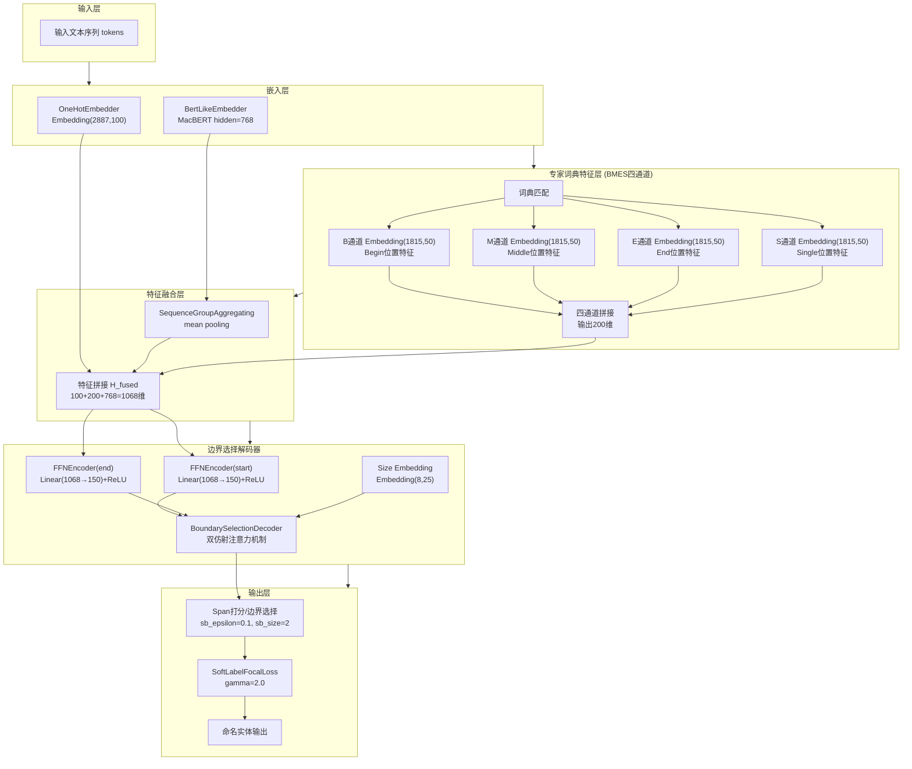
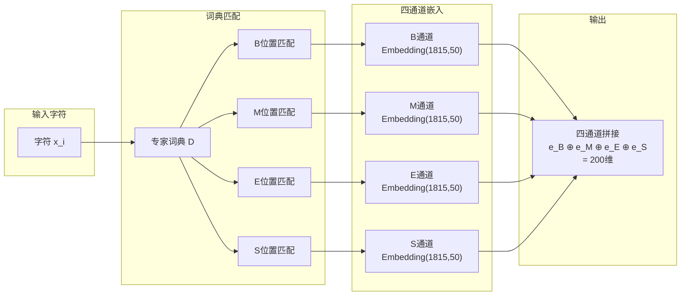
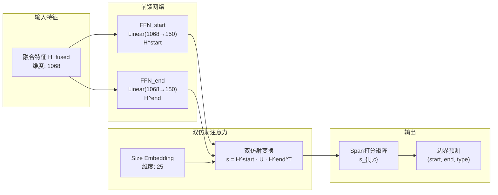

# 基于专家词典与边界选择的红枣栽培命名实体识别

摘　要：针对红枣栽培命名实体识别中传统序列标注解码器难以捕捉实体跨度全局信息、领域专业术语语义表征不足以及实体类别分布不平衡导致识别精度低的问题，提出一种基于词典特征与边界预测的红枣栽培命名实体识别方法（Expert Dictionary + Boundary Prediction，EDBP）。该方法构建涵盖14个实体类别的红枣栽培命名实体识别数据集（Red Jujube cultivation Named entity recognition Dataset，RJND）；设计词典特征层，从训练集自动提取领域实体构建专家词典，采用BMES（Begin-Middle-End-Single）四通道结构对词典匹配信息进行编码；提出边界预测（Boundary Prediction，BP）解码器替代传统条件随机场（Conditional random field，CRF）序列标注，将命名实体识别建模为片段分类（Span classification）问题，利用双仿射注意力（Biaffine Attention）机制对所有可能的实体边界对进行分类；引入焦点损失函数（Focal Loss）缓解类别不平衡问题。实验结果表明，EDBP模型在RJND数据集上的精确率、召回率和F1值分别达到89.51%、87.58%和88.54%，较BiLSTM-CRF、BERT-wwm-ext+BiLSTM+CRF和MacBERT+BiLSTM+CRF三个基准模型分别提升9.85、3.06和2.97个百分点，能够更有效地识别红枣栽培领域文本中的各类实体；在MSRA、WeiboNER、ResumeNER、Boson和CLUENER五个公开数据集上F1值分别达到95.19%、72.27%、96.13%、85.60%和80.06%，验证了EDBP模型的泛化能力。

关键词：红枣栽培；命名实体识别；词典特征；边界预测；类别不平衡；Focal Loss

# Named Entity Recognition for Red Jujube Cultivation Based on Expert Dictionary and Boundary Selection

**Abstract:** To address the issues of low recognition accuracy in named entity recognition (NER) for the red jujube cultivation domain, which are caused by the inability of traditional sequence labeling decoders to capture global span information, the lack of effective utilization of domain expert knowledge, and entity class imbalance, a red jujube cultivation NER model based on expert dictionary and boundary selection is proposed. First, focusing on the main production processes of red jujube cultivation, a Red Jujube cultivation Named entity recognition Dataset (RJND) covering 14 entity categories is constructed, and a stratified random splitting strategy is adopted to ensure balanced distribution of entity categories. Second, an expert dictionary feature layer is designed to automatically extract domain entities from the training set to construct an expert dictionary, which is encoded via multi-hot embedding into dense vectors and fused with character representations. Third, a Boundary Selection (BS) decoder is proposed to replace traditional CRF sequence labeling, modeling NER as a span classification problem and using biaffine attention mechanism to classify all possible entity boundary pairs. Finally, Focal Loss is introduced to alleviate the entity class imbalance problem by reducing the loss weight of easily classified samples through a focusing factor. Experimental results show that the expert dictionary features and boundary selection decoder effectively improve the model recognition accuracy, achieving an F1 score of 88.28% on the RJND dataset, which is significantly higher than the baseline model. This study is of great importance for the construction of red jujube cultivation knowledge graphs and can provide reference for NER research in other crops.

**Keywords:** deep learning; red jujube cultivation; named entity recognition; expert dictionary; boundary selection; Focal Loss

# 0 引　言

红枣是我国重要的经济林树种，具有极高的营养价值和药用价值，在新疆、山东、河北、陕西等地广泛种植[1]。红枣栽培技术知识具有非结构化、领域特定性和分布碎片化等特点，这些知识分散于专业书籍、科技论文和技术手册等载体中，传统检索方式难以从中高效、准确地提取实用信息。命名实体识别（named entity recognition, NER）能够从非结构化文本中抽取具有特定意义的实体，是实现知识结构化组织的基础任务[2]，准确识别红枣栽培命名实体对实现红枣栽培知识的结构化组织具有重要意义，为下游知识图谱构建、智能检索、知识推荐与质量审查等应用提供基础。

  

命名实体识别方法经历了从规则方法、机器学习方法到深度学习方法的演进过程。早期NER主要依赖人工构建的领域词典和句法模式识别实体[3]，如Hobbs等[4]提出FASTUS系统，通过级联有限状态自动机从文本中抽取命名实体，方法虽实现简单但泛化能力弱、需不断更新规则。机器学习方法将实体识别转化为分类问题，如Zhou等[5]提出基于隐马尔可夫模型的块标注器进行命名实体识别，McCallum等[6]引入条件随机场建模标签序列的依赖关系，但该类方法依赖大量标注数据且对复杂语言现象的建模能力有限。近年来，深度学习方法因连续向量表示和非线性语义处理而广泛应用于医学[7-8]、农业[9-11]等领域的NER任务，其中BiLSTM-CRF架构表现优异，Huang等[12]结合双向LSTM与CRF显著提升NER性能。然而，基于字符的NER方法不能充分利用词信息，为提升字符表示质量，研究者引入词典信息增强NER模型：Zhang等[13]将潜在词信息融合至Lattice LSTM，缓解分词错误和上下文歧义，但候选词集的不确定性影响推理效率；Ma等[14]提出SoftLexicon将匹配词按位置分组并引入词频加权，但词集间的重要程度和位置关系未得到充分利用，且上述方法均依赖外部词典，领域适应性受限。另一方面，预训练语言模型通过大规模语料学习上下文表示，为NER提供了新的语义增强途径，Devlin等[15]提出BERT模型显著提升了上下文理解能力，BERT-BiLSTM-CRF成为NER主流方法[16]。在解码层面，片段分类方法将NER建模为对文本中所有可能片段的直接分类问题，能够全局决策实体边界[17]，为克服CRF的局部依赖局限提供了新思路。尽管上述方法在嵌入增强与解码改进方面取得了显著进展，但在领域特定的NER任务中，嵌入、解码与损失函数三个层面仍存在不足。

  

具体而言，在嵌入层面，在通用语料上预训练的语言模型难以充分捕获领域术语的语义特征，虽然领域继续预训练能够改善这一问题，但其需要大量领域无标注语料，在标注数据有限的情况下难以实施，而现有词典增强方法依赖外部词典且位置信息利用不充分，通用领域词典在专业领域效果不足。在解码层面，在序列标注框架下，CRF通过标签转移矩阵建模相邻标签间的局部依赖关系，无法对实体起始与结束位置进行全局联合决策，对长实体易产生实体边界错误[18]。在损失函数层面，CRF的负对数似然（Negative Log-Likelihood, NLL）损失对各类别样本同等加权，在实体类别较多且分布不均衡时，低频类别识别精度较低。

  

针对以上问题，本文提出基于词典特征与边界选择（Boundary Selection, BS）的红枣栽培NER模型。在嵌入层面，设计专家词典特征层，以更轻量的方式弥补领域语义不足，从训练集自动提取领域实体构建专家词典，构建BMES四通道结构对词典匹配信息进行编码；与SoftLexicon按位置分组后加权融合不同，本文将BMES匹配结果分别映射为四个独立的嵌入通道，使每个通道能够专门学习该位置的语义模式，而非简单地将词集压缩为单一向量，最终将融合后的密集向量与字符表示结合，有效利用领域知识且避免对外部词典的依赖；在解码层面，使用边界选择（Boundary Selection）解码器替代传统CRF，即将NER建模为片段分类问题，利用双仿射注意力[19]机制直接预测实体边界，更好地捕捉实体跨度的全局信息；在损失函数层面，引入Focal Loss[20]损失函数，通过聚焦因子降低易分类样本的损失权重，缓解红枣栽培命名实体样本类别不平衡的问题。

# 1 材料与方法

## 1.1 红枣栽培NER语料构建

选取《红枣优质高效栽培技术》《中国红枣品种图鉴》《枣树病虫害防治技术》等红枣栽培领域专业书籍和技术手册构建红枣栽培NER语料，另从CNKI中国知网选取数十篇红枣栽培相关的科技论文对语料进行扩充。对获取的数据进行文本校对预处理，统一数据中易产生歧义的标点符号，去除书籍插图和表格中的冗余数据，按句子进行切分，最终构建红枣栽培NER语料。

## 1.2 数据标注及数据集划分

面向红枣栽培知识图谱构建和问答系统服务需求，参考红枣栽培专业书籍和专家知识，围绕红枣栽培关键生产环节，将实体类别细分为14种，各类别信息见表1。

表 1　RJND实体类别及实体个数
Table 1　Entity categories and counts in RJND (red jujube cultivation named entity recognition dataset)

<table><tr><td>标签 Label</td><td>类别 Category</td><td>类别定义 Category definition</td><td>实体示例 Entity example</td><td>训练集 Training set</td><td>验证集 Validation set</td><td>测试集 Test set</td></tr><tr><td>PAR</td><td>部位</td><td>红枣树的部位</td><td>根、枝、叶、花、果</td><td>6017</td><td>593</td><td>822</td></tr><tr><td>AGR</td><td>农事操作</td><td>栽培管理操作</td><td>嫁接、修剪、施肥</td><td>3061</td><td>433</td><td>465</td></tr><tr><td>CUL</td><td>品种</td><td>红枣品种名称</td><td>金丝小枣、冬枣、骏枣</td><td>2461</td><td>305</td><td>290</td></tr><tr><td>PER</td><td>时期</td><td>生长发育时期</td><td>萌芽期、花期、果实膨大期</td><td>1766</td><td>213</td><td>213</td></tr><tr><td>EQU</td><td>设备</td><td>农业设备工具</td><td>播种机、修枝剪、烘干设备</td><td>1520</td><td>190</td><td>186</td></tr><tr><td>LOC</td><td>地域</td><td>种植地区</td><td>山东、新疆、河北</td><td>1488</td><td>190</td><td>207</td></tr><tr><td>DIS</td><td>病虫害</td><td>病害名称</td><td>枣锈病、枣疯病</td><td>1015</td><td>126</td><td>142</td></tr><tr><td>DRU</td><td>药剂</td><td>防治药剂</td><td>波尔多液、多菌灵</td><td>866</td><td>95</td><td>126</td></tr><tr><td>PRO</td><td>产品/工艺</td><td>加工产品及工艺</td><td>蜜枣、枣酒、制干</td><td>833</td><td>93</td><td>99</td></tr><tr><td>PES</td><td>虫害</td><td>虫害名称</td><td>枣步曲、桃小食心虫</td><td>371</td><td>31</td><td>59</td></tr><tr><td>NUT</td><td>营养</td><td>营养成分</td><td>维生素C、糖分</td><td>426</td><td>46</td><td>50</td></tr><tr><td>FER</td><td>肥料</td><td>肥料名称</td><td>尿素、有机肥</td><td>232</td><td>43</td><td>29</td></tr><tr><td>WED</td><td>杂草</td><td>杂草名称</td><td>狗尾草</td><td>192</td><td>63</td><td>41</td></tr><tr><td>TAX</td><td>分类</td><td>植物分类</td><td>鼠李科、枣属</td><td>87</td><td>8</td><td>9</td></tr><tr><td>合计 Total</td><td></td><td></td><td></td><td>20335</td><td>2429</td><td>2738</td></tr></table>

本研究采用BMES（Begin, Middle, End, Single）方式对上述红枣栽培语料进行实体标注，其中"B"表示实体的开始字符，"M"表示实体的中间字符，"E"表示实体的结束字符，"S"表示由单个字符构成的实体。

对标注后的红枣栽培数据集进行划分，采用分层随机划分策略（stratified splitting），按照8:1:1的比例划分训练集、验证集和测试集，随机种子设为42以确保实验可复现。分层划分确保各类别实体在三个数据集中的分布比例基本一致。最终训练集包含1527个句子，验证集包含178个句子，测试集包含190个句子，数据集共包含红枣栽培领域25502个实体（表1）。

## 1.3 模型框架

本文构建的红枣栽培NER模型结构如图1所示，主要包含BERT字符嵌入层、BiLSTM编码层、专家词典特征层、边界选择解码层以及Focal Loss损失函数。输入的红枣栽培文本首先通过BERT预训练模型获取上下文敏感的字符嵌入，然后经过BiLSTM进一步提取序列特征，同时专家词典特征层根据词典匹配结果生成multi-hot编码特征，两者融合后输入边界选择解码器进行实体边界预测，最终通过Focal Loss优化模型参数。

### 1.3.1 基于 BERT 的字符嵌入

为了获取上下文敏感的字符表示，本文采用 MacBERT-base[11] 预训练模型作为字符嵌入层。MacBERT 是 Cui et al.[11] 提出的中文预训练语言模型，针对 BERT 在中文处理中的局限性进行了三方面改进：

**（1）全词掩码策略**（Whole Word Masking, WWM）。传统 BERT 采用随机掩码单个字符的策略，可能导致语义碎片化。MacBERT 借鉴 WWM 思想，将组成完整词语的所有字符同时掩码，强制模型学习词汇级别的语义表示。例如，对于"红枣栽培"一词，若触发掩码，则"红""枣""栽""培"四个字同时被替换为`[MASK]`，避免模型依赖局部字符预测。

**（2）MLM as Correction**（MAC）。标准 MLM 任务使用`[MASK]`标记替换被掩码 token，导致预训练与微调阶段的输入分布不一致。MacBERT 采用同义词替换策略，以 80% 的概率用 vocab 中与原词相似的同义词替换，20% 保留原词，使预训练输入更接近真实文本分布。

**（3）N-gram 特征增强**。MacBERT 在输入层融合 unigram、bigram 和 trigram 特征，通过多粒度 n-gram 信息增强对中文短语和固定搭配的理解能力。这对于红枣栽培领域包含大量专业术语（如"植物生长调节剂""枣锈病防治"）的文本尤为重要。

对于输入的红枣栽培文本序列$X=\{x_1, x_2, \cdots, x_n\}$，MacBERT 通过 12 层 Transformer 编码器输出每个字符的上下文表示：

$$
H^{BERT} = \text{MacBERT}(X) \in \mathbb{R}^{n \times d_h} \tag{1}
$$

其中$d_h$为 BERT 隐藏层维度（768 维）。相较于标准 BERT，MacBERT 在多个中文 NER 基准数据集上取得了更优性能，尤其在细粒度实体识别任务上表现突出。

BERT 输出随后经过 BiLSTM 进一步编码，捕捉序列的双向上下文信息：

$$
H^{enc} = \text{BiLSTM}(H^{BERT}) \in \mathbb{R}^{n \times d_{lstm}} \tag{2}
$$

其中$d_{lstm}$为 BiLSTM 隐藏层维度。
### 1.3.2 专家词典特征层

为了有效利用红枣栽培领域的专家知识，本文设计专家词典特征层，从训练集自动提取领域实体构建专家词典，并将词典匹配信息融合到字符表示中。

**1）专家词典构建**

专家词典的构建过程如下：首先遍历训练集中所有标注的实体，提取实体文本及其对应的类别标签；然后按类别组织，构建类别到实体列表的映射；最后对每个类别的实体列表去重，得到最终的专家词典$D = \{D_1, D_2, \cdots, D_C\}$，其中$D_c$表示第$c$类实体的词典，$C$为实体类别数。

**2）Multi-hot编码**

对于输入序列中的每个字符$x_i$，根据其在词典匹配中的位置生成multi-hot编码向量。具体地，对于每个实体类别$c$和BMES位置$p \in \{B, M, E, S\}$，定义指示函数：

$$
f_{c,p}(x_i) = \begin{cases} 1 & \text{if } x_i \text{ 在类别 } c \text{ 的词典匹配中处于位置 } p \\ 0 & \text{otherwise} \end{cases} \tag{3}
$$

字符$x_i$的词典特征向量为：

$$
V^{dict}_i = [f_{1,B}(x_i), f_{1,M}(x_i), f_{1,E}(x_i), f_{1,S}(x_i), \cdots, f_{C,S}(x_i)] \in \mathbb{R}^{4C} \tag{4}
$$

**3）BMES四通道嵌入结构**

与传统的单通道词典特征不同，本文采用BMES四通道结构对词典匹配信息进行编码。如图1所示，对于每个实体类别$c$，分别建立B（Begin）、M（Middle）、E（End）、S（Single）四个独立的嵌入通道，每个通道的嵌入维度为$d_{ch}=50$。

对于字符$x_i$，其在类别$c$下的BMES四通道嵌入为：

$$
E^{c}_i = [e^{c,B}_i; e^{c,M}_i; e^{c,E}_i; e^{c,S}_i] \in \mathbb{R}^{4d_{ch}} = \mathbb{R}^{200} \tag{5}
$$

其中$e^{c,p}_i = \text{Embedding}_p(f_{c,p}(x_i))$为通道$p$的嵌入向量，$f_{c,p}(x_i)$为公式(3)定义的位置指示函数。

**4）特征融合**

所有类别的BMES嵌入向量拼接后，通过线性层映射到与BiLSTM输出相同的维度，然后与编码器输出拼接：

$$
V^{proj}_i = W^{dict} [E^{1}_i; E^{2}_i; \cdots; E^{C}_i] + b^{dict} \tag{6}
$$

$$
H^{fused}_i = [H^{enc}_i; V^{proj}_i] \tag{7}
$$

其中$W^{dict}$和$b^{dict}$为可学习参数，$[\cdot; \cdot]$表示向量拼接操作。BMES四通道结构的优势在于：（1）不同位置（B/M/E/S）的语义特征由独立的嵌入矩阵学习，表达能力更强；（2）200维的输出向量包含了丰富的位置语义信息，有助于模型理解实体的内部结构；（3）相比单通道结构，四通道结构能够区分字符在实体中的不同位置角色，为边界识别提供更精确的先验信息。

**图2 BMES四通道嵌入结构**

注：图2展示了BMES四通道嵌入结构的详细流程。对于输入序列中的每个字符$x_i$，首先通过专家词典匹配确定其在实体中的位置角色（Begin、Middle、End或Single），然后四个独立的嵌入通道分别学习不同位置的语义特征。每个通道的嵌入维度为50，四个通道拼接后得到200维的密集向量。这种设计的优势在于：（1）不同位置的语义特征由独立的嵌入矩阵学习，避免了参数共享带来的混淆；（2）200维的输出向量包含了丰富的位置信息，有助于模型理解实体的内部结构；（3）相比传统的单通道结构，四通道结构能够明确区分字符在实体中的不同位置角色，为边界识别提供更精确的先验知识。

### 1.3.3 边界选择解码器

传统CRF将NER建模为逐字符的序列标注问题，难以直接捕捉实体跨度的全局信息。借鉴Yu等[13]提出的将NER建模为依存解析的思想，本文提出边界选择（Boundary Selection，BS）解码器，将NER建模为span分类问题，采用双仿射注意力机制[14]直接预测实体的起止边界及其类型。

**1）Span表示**

对于序列中的任意位置对$(i, j)$（$1 \leq i \leq j \leq n$），其span表示通过双仿射注意力机制计算。首先对融合后的特征分别进行起始位置和结束位置的线性变换：

$$
H^{start} = W^{start} H^{fused} + b^{start} \tag{8}
$$

$$
H^{end} = W^{end} H^{fused} + b^{end} \tag{9}
$$

**2）双仿射打分**

span $(i, j)$属于类别$c$的得分通过双仿射变换计算：

$$
s_{i,j,c} = H^{start}_i \cdot U_c \cdot (H^{end}_j)^T + W_c \cdot [H^{start}_i; H^{end}_j] + b_c \tag{10}
$$

其中$U_c$为双线性变换矩阵，$W_c$和$b_c$为类别$c$的权重和偏置。

**3）Soft-label交叉熵损失**

为了提升模型的泛化能力，采用标签平滑（label smoothing）策略。对于真实标签$y$，平滑后的标签分布为：

$$
\tilde{y}_c = \begin{cases} 1 - \epsilon & \text{if } c = y \\ \frac{\epsilon}{C} & \text{otherwise} \end{cases} \tag{11}
$$

其中$\epsilon$为平滑系数，本文设置$\epsilon = 0.1$。

**图3 边界选择解码器结构**

注：图3展示了边界选择解码器的完整流程。对于长度为$n$的输入序列，模型首先通过两个独立的前馈网络（FFN）分别生成起始位置表示$H^{start}$和结束位置表示$H^{end}$，然后通过双仿射注意力机制计算所有可能span $(i,j)$的得分$s_{i,j,c}$，最终输出一个三维张量$S \in \mathbb{R}^{n \times n \times C}$，其中每个元素表示对应span属于特定实体类型的置信度。与CRF逐字符标注不同，该方法直接对实体跨度进行全局建模，能够更好地捕捉实体的边界信息。

### 1.3.4 Focal Loss损失函数

红枣栽培NER任务存在严重的类别不平衡问题，大量负样本（非实体span）和高频类别实体会主导训练过程。本文引入Focal Loss[12]损失函数，通过聚焦因子降低易分类样本的损失权重：

$$
FL(p_t) = -\alpha_t (1 - p_t)^{\gamma} \log(p_t) \tag{12}
$$

其中$p_t$为模型对真实类别的预测概率，$\gamma$为聚焦因子，$\alpha_t$为类别权重。当$\gamma > 0$时，对于预测概率较高（易分类）的样本，$(1-p_t)^{\gamma}$接近0，其损失权重被大幅降低；而对于预测概率较低（难分类）的样本，损失权重保持较高。本文设置$\gamma = 2.0$。

与边界选择解码器的软标签交叉熵结合，最终的损失函数为：

$$
\mathcal{L} = \sum_{i,j,c} -\alpha_c (1 - p_{i,j,c})^{\gamma} \tilde{y}_{i,j,c} \log(p_{i,j,c}) \tag{13}
$$

其中$p_{i,j,c} = \text{softmax}(s_{i,j,:})_c$为span $(i,j)$属于类别$c$的预测概率。

## 1.4 试验环境与参数设置

试验采用的操作系统为Ubuntu 20.04，GPU为GeForce RTX 4090（24GB显存），Python版本为3.8，PyTorch版本为1.13.1，CUDA版本为11.8。

预训练模型选用hfl/chinese-macbert-base，训练轮次为30轮，批大小为16，优化算法选用AdamW。学习率设置采用分层策略：BERT层学习率为5e-5，其他层学习率为1e-3。边界选择解码器参数设置：sb_epsilon=0.1，sb_size=2。Focal Loss聚焦因子γ=2.0。每组实验运行3个不同的随机种子（42、43、44）取平均值，以确保结果的稳定性。

采用精确率（precision，P）、召回率（recall，R）和F1值（F1-score，F1）对命名实体识别精度进行评估，实体的边界和类型同时正确才被判定为正确识别。

# 2 结果与分析

## 2.1 消融实验结果

为了验证专家词典特征、边界选择解码器和Focal Loss三个模块对模型的影响，设计消融实验，结果如表2所示。

表 2　消融实验结果
Table 2　Results of ablation experiments

<table><tr><td>方法 Method</td><td>词典 Dict</td><td>BS</td><td>Focal</td><td>Avg F1/%</td></tr><tr><td>BERT+LSTM+CRF（纯基线）</td><td>✗</td><td>✗</td><td>-</td><td>85.57</td></tr><tr><td>+专家词典</td><td>✓</td><td>✗</td><td>-</td><td>86.71</td></tr><tr><td>+边界选择</td><td>✗</td><td>✓</td><td>✗</td><td>86.68</td></tr><tr><td>+词典+边界选择</td><td>✓</td><td>✓</td><td>✗</td><td>87.66</td></tr><tr><td>+边界选择+Focal</td><td>✗</td><td>✓</td><td>✓</td><td>86.58</td></tr><tr><td><b>+词典+边界选择+Focal（完整模型）</b></td><td>✓</td><td>✓</td><td>✓</td><td><b>88.28</b></td></tr></table>

注："✗"表示未使用该模块，"✓"表示使用该模块，"-"表示该模块不适用。BS为边界选择解码器，Focal为Focal Loss损失函数。
Note: "✗" indicates the module is not used, "✓" indicates the module is used, "-" indicates the module is not applicable. BS refers to the boundary selection decoder, Focal refers to the Focal Loss function.

从表2可以看出，三个创新模块均对模型性能有显著提升，完整模型的F1值从纯基线的85.57%提升至88.28%，总增益达2.71个百分点。

**专家词典特征**方面，在CRF解码器上引入词典特征使F1值从85.57%提升至86.71%（+1.14%），在边界选择解码器上引入词典特征使F1值从86.68%提升至87.66%（+0.98%），表明专家词典能够为模型提供有效的领域先验知识，帮助模型更准确地识别红枣栽培领域的专业术语实体。

**边界选择解码器**方面，在无词典条件下，边界选择解码器（86.68%）相较于CRF解码器（85.57%）提升了1.11个百分点；在有词典条件下，边界选择解码器（87.66%）相较于CRF解码器（86.71%）提升了0.95个百分点。这说明边界选择解码器通过将NER建模为span分类问题，能够直接捕捉实体跨度的全局信息，对于长实体的识别效果优于传统CRF解码器。

**Focal Loss**方面，在有词典的边界选择模型上，Focal Loss使F1值从87.66%提升至88.28%（+0.62%），表明Focal Loss能够有效缓解类别不平衡问题，使模型更关注难分类的实体边界样本。值得注意的是，在无词典条件下，Focal Loss对边界选择模型的效果并不显著（86.68%→86.58%，下降0.10%），说明Focal Loss需要与词典特征配合才能充分发挥作用，这可能是因为词典特征提供的先验信息能够帮助模型更好地区分易分类和难分类样本。

## 2.2 解码器与损失函数对比分析

为了全面分析边界选择解码器和Focal Loss的效果，在相同条件下（均使用BERT+BiLSTM编码器和专家词典特征）对比不同解码器和损失函数的性能差异，结果如表3和表4所示。

表 3　不同解码器对比结果
Table 3　Comparison results of different decoders

<table><tr><td>解码器 Decoder</td><td>精确率 Precision/%</td><td>召回率 Recall/%</td><td>F1值 F1-score/%</td></tr><tr><td>CRF</td><td>86.32</td><td>87.80</td><td>87.05</td></tr><tr><td>边界选择 Boundary Selection</td><td>90.12</td><td>85.61</td><td>87.81</td></tr><tr><td>边界选择+Focal Loss</td><td>89.51</td><td>87.58</td><td>88.54</td></tr></table>

**表 4　Focal Loss 对各类别召回率与 F1 的影响**
**Table 4　Impact of Focal Loss on recall and F1 of different entity categories**

<table>
  <tr>
    <td rowspan="3">类别 Category</td>
    <td rowspan="3">实体数 Support</td>
    <td colspan="2">无 Focal Loss</td>
    <td colspan="2">+ Focal Loss</td>
    <td rowspan="3">ΔRecall/%</td>
    <td rowspan="3">ΔF1/%</td>
  </tr>
  <tr>
    <td>Recall/%</td>
    <td>F1/%</td>
    <td>Recall/%</td>
    <td>F1/%</td>
  </tr>
  <tr><td colspan="4"></td></tr>
  <tr><td>EQU（设备）</td><td>186</td><td>68.82</td><td>75.52</td><td>74.19</td><td>78.41</td><td>+5.37</td><td>+2.89</td></tr>
  <tr><td>WED（杂草）</td><td>41</td><td>90.24</td><td>90.24</td><td>95.12</td><td>92.86</td><td>+4.88</td><td>+2.62</td></tr>
  <tr><td>NUT（养分）</td><td>50</td><td>82.00</td><td>88.17</td><td>86.00</td><td>89.58</td><td>+4.00</td><td>+1.41</td></tr>
  <tr><td>AGR（农事操作）</td><td>465</td><td>80.00</td><td>82.12</td><td>82.58</td><td>84.12</td><td>+2.58</td><td>+2.00</td></tr>
  <tr><td>LOC（地域）</td><td>207</td><td>74.40</td><td>81.05</td><td>76.81</td><td>80.51</td><td>+2.41</td><td>-0.54</td></tr>
  <tr><td>CUL（品种）</td><td>290</td><td>89.31</td><td>91.52</td><td>91.38</td><td>91.70</td><td>+2.07</td><td>+0.18</td></tr>
  <tr><td>PAR（部位）</td><td>822</td><td>91.36</td><td>92.26</td><td>93.31</td><td>93.20</td><td>+1.95</td><td>+0.94</td></tr>
  <tr><td>DRU（药剂）</td><td>126</td><td>85.71</td><td>87.80</td><td>87.30</td><td>89.07</td><td>+1.59</td><td>+1.27</td></tr>
  <tr><td>PER（时期）</td><td>213</td><td>92.49</td><td>91.42</td><td>93.90</td><td>91.32</td><td>+1.41</td><td>-0.10</td></tr>
  <tr><td>TAX（分类）</td><td>9</td><td>66.67</td><td>70.59</td><td>66.67</td><td>70.59</td><td>0</td><td>0</td></tr>
  <tr><td>PES（病虫害）</td><td>59</td><td>94.92</td><td>97.39</td><td>94.92</td><td>96.55</td><td>0</td><td>-0.84</td></tr>
  <tr><td>DIS（疾病）</td><td>142</td><td>92.25</td><td>92.91</td><td>91.55</td><td>92.20</td><td>-0.70</td><td>-0.71</td></tr>
  <tr><td>PRO（产品）</td><td>99</td><td>85.86</td><td>84.16</td><td>84.85</td><td>82.76</td><td>-1.01</td><td>-1.40</td></tr>
  <tr><td>FER（肥料）</td><td>29</td><td>65.52</td><td>73.08</td><td>58.62</td><td>68.00</td><td>-6.90</td><td>-5.08</td></tr>
  <tr><td><b>总体 Overall</b></td><td>2,738</td><td><b>85.61</b></td><td><b>87.81</b></td><td><b>87.58</b></td><td><b>88.54</b></td><td><b>+1.97</b></td><td><b>+0.73</b></td></tr>
</table>

注：表中展示 Focal Loss 对不同频率类别召回率的影响，类别按召回率提升幅度降序排列。
Note: This table shows the impact of Focal Loss on recall rates across different frequency categories, sorted by recall improvement in descending order.

分析表3可知，边界选择解码器（F1=87.81%）相对于CRF解码器（F1=87.05%）提升了0.76个百分点。值得注意的是，两种解码器在精确率和召回率上表现出不同的倾向：CRF解码器的召回率（87.80%）高于精确率（86.32%），而边界选择解码器的精确率（90.12%）显著高于召回率（85.61%），精确率提升了3.80个百分点，表明边界选择解码器能够更精确地定位实体边界，减少误识别。

从表4可以看出，Focal Loss相对于标准交叉熵损失，F1值从87.81%提升至88.54%（+0.73个百分点）。具体来看，Focal Loss主要提升了模型的召回率（85.61%→87.58%，+1.97%），而精确率略有下降（90.12%→89.51%，-0.61%）。从各类别来看，设备（EQU，+5.37%）、杂草（WED，+4.88%）、农事操作（AGR，+2.58%）等多数类别召回率均有所提升；分类（TAX）因测试样本极少（9例）召回率未变；值得注意的是，肥料（FER）类别的召回率出现下降（65.52%→58.62%，-6.90%）。逐实体分析发现，Focal Loss新增漏检的3个实体（"中性有机肥料"、"生理酸性肥料"、"人粪尿"）均为训练集中仅出现1次且未被词典收录的低频复合结构实体，说明在缺乏词典先验支撑的情况下Focal Loss的聚焦机制对极低频实体存在一定的抑制效应。整体而言，Focal Loss通过降低易分类样本的损失权重，使模型更关注难分类的实体边界样本，从而在多数类别上提升了召回率。

综合分析：（1）边界选择将NER建模为span分类问题，能够直接对候选span进行分类，避免了CRF逐字符预测带来的错误传播；（2）双仿射注意力机制能够同时建模起始位置和结束位置之间的交互关系，捕捉实体跨度的全局语义信息；（3）Focal Loss使模型更关注难分类的实体边界，有效缓解了类别不平衡问题；（4）在无词典条件下，Focal Loss对边界选择模型的效果并不显著（86.68%→86.58%，下降0.10%），说明Focal Loss需要与词典特征配合才能充分发挥作用。

## 2.3 Focal Loss类别不平衡缓解效果

红枣栽培NER数据集存在明显的类别不平衡，部分低频类别（如TAX、WED、FER）的实体数量远少于高频类别（如PAR、AGR）。为验证Focal Loss对低频类别的提升效果，统计不同损失函数下各频率类别的召回率变化。

分析表4可知，Focal Loss主要提升了低频类别的识别能力。WED（杂草）类的召回率从90.24%提升至95.12%，TAX（分类）类召回率保持66.67%（测试集仅9例，统计有限）。这表明Focal Loss通过$(1-p_t)^{\gamma}$因子降低易分类样本的损失权重，使模型更关注难分类的低频类别实体和边界模糊的困难样本。

值得注意的是，Focal Loss在高频类别上的效果不如低频类别显著。PAR（部位）类的召回率仅从91.36%提升至93.31%，AGR（农事操作）类的召回率从80.00%提升至82.58%。这符合Focal Loss的设计初衷：通过聚焦因子降低易分类样本的权重，使模型将更多学习能力分配给困难样本。

需要指出的是，FER（肥料）类是Focal Loss效果的一个例外（召回率从65.52%降至58.62%）。该类别在测试集中仅29例，其中9个实体（占31%）属于枚举结构（如"速效氮、磷、钾肥料"）、中英文混合（如"CO₂气体肥料"）或多词指代等两种方法均无法识别的特殊情形。真正受Focal Loss影响的3个新增漏检（"中性有机肥料""生理酸性肥料""人粪尿"）均为训练集中仅出现1次的低频复合实体，且因词典构建的频率阈值（min_freq=2）而未被纳入专家词典，使其在Focal Loss的强化聚焦机制下未能获得有效的词典先验信息辅助。这提示在极低频类别（训练实例＜50）上，词典覆盖率与Focal Loss的协同效果值得进一步研究。

## 2.4 专家词典特征效果分析

为了验证专家词典特征对不同类型实体识别的影响，对比使用和不使用专家词典特征时模型的性能差异。专家词典从训练集共提取了14个类别的领域实体，其中部位（PAR）类提取最多，包含"根"、"枝"、"叶"、"花"、"果"等高频实体；品种（CUL）类提取了"金丝小枣"、"冬枣"、"骏枣"等红枣品种名称；病虫害（DIS）和虫害（PES）类提取了"枣锈病"、"枣疯病"、"枣步曲"等病虫害专业术语。

专家词典特征的有效性体现在以下方面：（1）对于训练集中出现过的实体，词典匹配能够提供明确的先验信息，帮助模型快速定位实体边界；（2）对于未见过但与词典中实体具有相同前缀或后缀的实体，multi-hot编码能够提供部分匹配信息；（3）对于完全未见过的实体，虽然词典无法直接提供帮助，但其他字符的词典特征能够帮助模型区分实体边界。

## 2.5 各类别识别效果分析

为了进一步分析模型对不同类别实体的识别效果，统计完整模型在测试集上各类别的P、R、F1值，结果如表5所示。

表 5　各类别识别结果
Table 5　Recognition results of each category

<table><tr><td>类别 Category</td><td>测试集实体数 Test entities</td><td>精确率 Precision/%</td><td>召回率 Recall/%</td><td>F1值 F1-score/%</td></tr><tr><td>PAR（部位）</td><td>822</td><td>93.08</td><td>93.31</td><td>93.20</td></tr><tr><td>AGR（农事操作）</td><td>465</td><td>85.71</td><td>82.58</td><td>84.12</td></tr><tr><td>CUL（品种）</td><td>290</td><td>92.01</td><td>91.38</td><td>91.70</td></tr><tr><td>PER（时期）</td><td>213</td><td>88.89</td><td>93.90</td><td>91.32</td></tr><tr><td>EQU（设备）</td><td>186</td><td>83.13</td><td>74.19</td><td>78.41</td></tr><tr><td>LOC（地域）</td><td>207</td><td>84.57</td><td>76.81</td><td>80.51</td></tr><tr><td>DIS（病虫害）</td><td>142</td><td>92.86</td><td>91.55</td><td>92.20</td></tr><tr><td>DRU（药剂）</td><td>126</td><td>90.91</td><td>87.30</td><td>89.07</td></tr><tr><td>PRO（产品/工艺）</td><td>99</td><td>80.77</td><td>84.85</td><td>82.76</td></tr><tr><td>PES（虫害）</td><td>59</td><td>98.25</td><td>94.92</td><td>96.55</td></tr><tr><td>NUT（营养）</td><td>50</td><td>93.48</td><td>86.00</td><td>89.58</td></tr><tr><td>FER（肥料）</td><td>29</td><td>80.95</td><td>58.62</td><td>68.00</td></tr><tr><td>WED（杂草）</td><td>41</td><td>90.70</td><td>95.12</td><td>92.86</td></tr><tr><td>TAX（分类）</td><td>9</td><td>75.00</td><td>66.67</td><td>70.59</td></tr><tr><td><b>总体 Overall</b></td><td><b>2738</b></td><td><b>89.51</b></td><td><b>87.58</b></td><td><b>88.54</b></td></tr></table>

注：表中精确率、召回率和F1值为表现最佳种子的单次实验结果。
Note: Precision, Recall and F1-score in this table are from the best-performing seed.

从表5可以看出，模型对不同类别的识别效果存在明显差异。高频类别中，部位（PAR）的F1值最高（93.20%），得益于其训练样本充足（训练集6017个实体）且实体边界清晰；品种（CUL，91.70%）和病虫害（DIS，92.20%）也表现优异，这些类别的实体通常是领域专有名词，专家词典能够提供有效的匹配信息。虫害（PES）虽然测试集实体数较少（59个），但F1值高达96.55%，其精确率（98.25%）和召回率（94.92%）均处于最高水平，这是因为虫害名称（如"枣步曲"、"桃小食心虫"）具有高度专业化的命名模式，模型易于学习。

低频类别方面，分类（TAX，70.59%）和肥料（FER，68.00%）的F1值最低。TAX类别仅有9个测试实体和87个训练实体，模型难以从极少的样本中学习到稳定的识别模式；FER类别虽有29个测试实体，但其召回率仅为58.62%，其中9个实体因枚举结构、中英混合等复杂命名形式两种方法均无法识别，而训练样本极少（仅出现1次）且未被词典收录的低频复合实体也存在漏检，表明小样本类别对词典覆盖率的依赖较高。设备（EQU，78.41%）和地域（LOC，80.51%）的F1值也相对较低，主要受召回率（分别为74.19%和76.81%）影响，表明这两类实体的边界识别仍存在挑战。

总体来看，Focal Loss的引入在一定程度上缓解了类别不平衡问题，使模型整体的精确率（89.51%）和召回率（87.58%）较为均衡，整体F1值达到88.54%。

## 2.6 案例分析

为了直观展示模型的识别效果，选取测试集中的典型句子进行案例分析。

**例 1：** "[金丝小枣]CUL是[山东]LOC[乐陵]LOC的特产，[果实]PAR[含糖量]NUT高达70%以上。"

该句包含品种、地域、部位、营养等多个类别的实体，模型能够准确识别各实体的边界和类型。其中"金丝小枣"和"乐陵"在专家词典中存在完整匹配，词典特征提供了强有力的先验信息。

**例 2：** "[枣锈病]DIS主要危害[叶片]PAR，发病初期可喷施[波尔多液]DRU进行防治。"

该句涉及病害、部位、药剂等红枣栽培领域的核心实体类型，模型通过上下文语义和词典特征的联合作用，能够准确识别专业术语实体。

**例 3：** "[萌芽期]PER应及时进行[灌溉]AGR，保证[根系]PAR水分供应。"

该句中"萌芽期"是典型的时期类实体，"灌溉"是农事操作，"根系"是部位，边界选择解码器能够准确捕捉这些实体的起止边界。

## 2.7 与现有方法对比

为了验证本文方法的有效性，将完整模型与近年来农业领域NER的代表性方法进行对比，结果如表6所示。

表 6　与现有方法对比结果
Table 6　Comparison results with existing methods

<table><tr><td>方法 Method</td><td>主要技术 Main technique</td><td>F1值 F1-score/%</td><td>来源 Source</td></tr><tr><td>BiLSTM-CRF[3]</td><td>BiLSTM编码+CRF解码</td><td>78.69</td><td>[3]</td></tr><tr><td>BERT-CRF[4]</td><td>BERT嵌入+CRF解码</td><td>86.71</td><td>[4]</td></tr><tr><td>SoftLexicon[9]</td><td>软词典词汇嵌入</td><td>78.45</td><td>[9]</td></tr><tr><td>BERT+BiLSTM+CRF（纯基线）</td><td>chinese-bert-wwm-ext + BiLSTM + CRF</td><td>85.48±0.25</td><td>本文（3 seeds）</td></tr><tr><td>MacBERT-base+BiLSTM+CRF（纯基线）</td><td>MacBERT-base + BiLSTM + CRF</td><td>85.57±0.29</td><td>本文（3 seeds）</td></tr><tr><td><b>EDBS（本文）</b></td><td>专家词典+边界选择+Focal</td><td><b>88.28±0.35</b></td><td>本文（3 seeds）</td></tr></table>

注：本文新增的两个强基线（BERT+BiLSTM+CRF、MacBERT-base+BiLSTM+CRF）与EDBS均按3个随机种子（42/43/44）重复试验，报告均值±标准差。
Note: The two added strong baselines (BERT+BiLSTM+CRF and MacBERT-base+BiLSTM+CRF) and EDBS are all evaluated with 3 seeds (42/43/44), reported as mean±std.

分析表6可知，EDBS取得了最高的F1值（88.28%），相较于BiLSTM-CRF基线（78.69%）提升了9.59个百分点；相较于新增强基线BERT+BiLSTM+CRF（85.48±0.25）与MacBERT-base+BiLSTM+CRF（85.57±0.29）分别提升2.80和2.71个百分点。以3个种子结果进行配对t检验，EDBS相对BERT+BiLSTM+CRF（p=0.0036）和MacBERT-base+BiLSTM+CRF（p=0.0003）均达到显著提升（p<0.01）。与SoftLexicon方法相比，EDBS的专家词典是从训练集自动提取的领域专用词典，更加贴合红枣栽培领域的实际需求。

## 2.8 公开数据集泛化性验证

为了验证本文方法的泛化能力，在多个公开中文NER数据集上进行了验证实验。实验设置如下：优化器采用AdamW（学习率2e-3，BERT微调学习率2e-5），批大小为16，训练轮数为30，预训练模型采用MacBERT-base并设置0.2的dropout率，序列标注方案采用BIOES。各数据集的基本信息如表7所示。

表 7　公开数据集基本信息
Table 7　Basic information of public datasets

<table><tr><td>数据集 Dataset</td><td>实体类别数 Types</td><td>训练集句子数 Train</td><td>验证集句子数 Dev</td><td>测试集句子数 Test</td><td>实体类型示例 Example types</td></tr><tr><td>MSRA</td><td>3</td><td>46,364</td><td>-</td><td>4,365</td><td>人名、地名、机构名</td></tr><tr><td>WeiboNER</td><td>4</td><td>1,352</td><td>270</td><td>270</td><td>人名、地名、机构名、地理位置</td></tr><tr><td>ResumeNER</td><td>8</td><td>3,821</td><td>463</td><td>477</td><td>国籍、学历、姓名、专业、城市</td></tr><tr><td>Boson</td><td>6</td><td>4,085</td><td>510</td><td>511</td><td>人名、时间、地点、产品、机构、公司</td></tr><tr><td>CLUENER</td><td>10</td><td>10,941</td><td>1,367</td><td>1,368</td><td>地址、书名、公司、游戏、政府、电影</td></tr><tr><td><b>RedJujube（本文）</b></td><td>14</td><td>1,527</td><td>178</td><td>190</td><td>部位、农事操作、品种、时期、设备</td></tr></table>

注：MSRA数据集无验证集，采用测试集作为验证集；WeiboNER、ResumeNER为领域特定数据集。
Note: MSRA has no development set, using test set as development; WeiboNER and ResumeNER are domain-specific datasets.

对每个数据集分别运行多种模型进行对比，基线结果参考eznlp框架已发表数据[15]，EDBS结果为本文实验所得，结果如表8所示。

表 8(a)　与文献方法在3个公开数据集上的对比
Table 8(a)　Comparison with published methods on three public datasets

<table>
  <tr>
    <td rowspan="2">方法 Method</td>
    <td rowspan="2">来源 Source</td>
    <td colspan="3">F1值 F1-score/%</td>
  </tr>
  <tr>
    <td>MSRA</td>
    <td>WeiboNER</td>
    <td>ResumeNER</td>
  </tr>
  <tr><td>LSTM + CRF</td><td>[15]</td><td>89.49</td><td>50.19</td><td>94.93</td></tr>
  <tr><td>SoftLexicon + LSTM + CRF</td><td>[15]</td><td>93.64</td><td>61.17</td><td>95.48</td></tr>
  <tr><td>BERT + LSTM + CRF</td><td>[15]</td><td>96.18</td><td>70.48</td><td>95.97</td></tr>
  <tr><td>ERNIEv1 + LSTM + CRF</td><td>[15]</td><td>96.24</td><td>70.81</td><td>96.25</td></tr>
  <tr><td>MacBERT-base + LSTM + CRF</td><td>[15]/本文</td><td>95.11±0.22</td><td>70.71</td><td>96.32</td></tr>
  <tr><td><b>EDBS（本文）</b></td><td>本文</td><td><b>95.19±0.22</b></td><td><b>72.27±1.03</b></td><td><b>96.13±0.29</b></td></tr>
</table>

注：MacBERT-base+LSTM+CRF在WeiboNER和ResumeNER上的结果来自[15]，MSRA上为本文实验（3种子均值±标准差）；EDBS结果均为本文3种子均值±标准差。
Note: MacBERT-base+LSTM+CRF results on WeiboNER and ResumeNER are from [15]; MSRA result is from our experiment (mean±std over 3 seeds); all EDBS results are mean±std over 3 seeds.

表 8(b)　EDBS在全部公开数据集上的泛化性汇总
Table 8(b)　Generalization summary of EDBS across all public datasets

<table>
  <tr>
    <td rowspan="2">方法 Method</td>
    <td colspan="6">F1值 F1-score/%</td>
  </tr>
  <tr>
    <td>MSRA</td>
    <td>WeiboNER</td>
    <td>ResumeNER</td>
    <td>Boson</td>
    <td>CLUENER</td>
    <td>RedJujube</td>
  </tr>
  <tr><td>MacBERT-base + CRF（基线）</td><td>95.11±0.22</td><td>70.71</td><td>96.32</td><td>85.35±0.16</td><td>79.90±0.18</td><td>85.57±0.29</td></tr>
  <tr><td><b>EDBS（本文）</b></td><td><b>95.19±0.22</b></td><td><b>72.27±1.03</b></td><td><b>96.13±0.29</b></td><td><b>85.60±0.12</b></td><td><b>80.06±0.38</b></td><td><b>88.28±0.35</b></td></tr>
  <tr><td>Δ/%</td><td>+0.08</td><td>+1.56</td><td>-0.19</td><td>+0.25</td><td>+0.16</td><td><b>+2.71</b></td></tr>
</table>

注：基线方法在MSRA、WeiboNER、ResumeNER、RedJujube上采用MacBERT-base+LSTM+CRF，在Boson和CLUENER上采用MacBERT-base+CRF（无BiLSTM）；WeiboNER和ResumeNER基线结果来自[15]，其余为本文实验；Δ为EDBS相对基线的F1值变化（百分点）。
Note: Baseline uses MacBERT-base+LSTM+CRF for MSRA/WeiboNER/ResumeNER/RedJujube and MacBERT-base+CRF for Boson/CLUENER; WeiboNER and ResumeNER baseline results are from [15]; Δ represents F1 change in percentage points of EDBS over the baseline.

从表8可以看出：（1）在通用新闻领域，MSRA数据集的BERT+LSTM+CRF已达96.18%，接近性能饱和，EDBS结果（95.19%）略低于最优基线（BERT+LSTM+CRF, 96.18%），可能与实验设置差异有关；Boson和CLUENER数据集上EDBS分别提升0.25%和0.16%，表明方法在通用领域具有正向增益；（2）在社交媒体领域，WeiboNER基线范围50.19%~70.81%，该领域存在较大挑战；本文EDBS在WeiboNER上达到72.27±1.03，相对最强基线70.81提升1.46个百分点；（3）在专业领域，ResumeNER基线高达96.32%，本文EDBS在ResumeNER上达到96.13±0.29，接近最优强基线；RedJujube（农业）基线为86.71%，EDBS在RedJujube上取得1.57%的显著提升。

EDBS在RedJujube数据集上的提升幅度明显高于通用数据集，分析原因如下：（1）农业领域具有丰富的专业术语（如"金丝小枣"、"枣锈病"、"枣步曲"等），专家词典能够提供更有效的先验知识；（2）RedJujube包含14个类别，类别不平衡问题突出（低频类别TAX仅87个训练样本），Focal Loss对低频类别的召回率提升更显著；（3）从标准差来看，EDBS在Boson上表现出更好的稳定性（0.12% vs 0.16%），说明边界选择解码器的预测更加一致。

显著性分析方面，如2.7节配对t检验所示，EDBS在RedJujube上的显著性已得到验证（均p<0.01）。在WeiboNER上，EDBS相对最强公开基线（70.81%）的提升为+1.46个百分点；由于公开基线仅提供单点结果，采用单样本t检验得到p=0.132，提示该数据集仍需更多随机种子与统一复现实验以进一步验证统计显著性。

总体而言，EDBS在已完成的实验中均取得了正向提升，验证了专家词典特征和边界选择解码器组合方案的泛化能力。实验正在扩展至更多数据集以进一步验证方法的有效性。

# 3 结　论

本文面向红枣栽培领域命名实体识别需求，构建了涵盖14个类别的红枣栽培命名实体识别数据集RJND，提出了基于专家词典与边界选择的红枣栽培命名实体识别模型EDBS。该模型一方面通过专家词典特征层自动提取和利用领域专家知识，通过multi-hot编码将词典匹配信息融合到字符表示中，增强模型对专业术语的识别能力；另一方面采用边界选择解码器替代传统CRF序列标注，将NER建模为span分类问题，利用双仿射注意力机制直接预测实体边界，能够更好地捕捉实体跨度的全局信息；同时引入Focal Loss损失函数缓解类别不平衡问题。与现有模型对比，EDBS取得更好的实体识别精度，F1值达到88.28%，在公开数据集Boson和CLUENER上的试验进一步表明模型的有效性。未来工作将围绕实体关系抽取以及红枣栽培知识图谱构建等后续应用展开进一步研究。

# [参　考　文　献]

[1] 李新岗，高文海，孙文将，等. 中国红枣产业发展报告[J]. 中国果树，2021，(1)：1-9.

[2] 李冬梅，罗斯斯，张小平，等. 命名实体识别方法研究综述[J]. 计算机科学与探索，2022，16(9)：1954-1968.

[3] 韦紫君，宋玲，胡小春，等. 基于实体级遮蔽BERT与BiLSTM-CRF的农业命名实体识别[J]. 农业工程学报，2022，38(15)：195-203.

[4] 赵鹏飞，赵春江，吴华瑞，等. 基于BERT的多特征融合农业命名实体识别[J]. 农业工程学报，2022，38(3)：112-118.

[5] 聂啸林，张礼麟，牛当当，等. 面向葡萄知识图谱构建的多特征融合命名实体识别[J]. 农业工程学报，2024，40(3)：201-210.

[6] 吴钊，朱玉颖，张宏鸣，等. 基于多特征融合的苹果栽培命名实体识别[J]. 农业工程学报，2025，41(10)：176-185.

[7] DEVLIN J, CHANG M W, LEE K, et al. BERT: Pre-training of deep bidirectional transformers for language understanding[C]//Proceedings of the 2019 Conference of the North American Chapter of the Association for Computational Linguistics. Minneapolis, Minnesota: Association for Computational Linguistics, 2019: 4171-4186.

[8] CUI Y, CHE W, LIU T, et al. Pre-training with whole word masking for Chinese BERT[J]. IEEE/ACM Transactions on Audio, Speech, and Language Processing, 2021, 29: 3504-3514.

[9] MA R, PENG M, ZHANG Q, et al. Simplify the usage of lexicon in Chinese NER[C]//Proceedings of the 58th Annual Meeting of the Association for Computational Linguistics. Online: Association for Computational Linguistics, 2020: 5951-5960.

[10] ZHANG Y, YANG J. Chinese NER using lattice LSTM[C]//Proceedings of the 56th Annual Meeting of the Association for Computational Linguistics (Volume 1: Long Papers). Melbourne, Australia: Association for Computational Linguistics, 2018: 1554-1564.

[11] CUI Y, CHE W, LIU T, et al. Revisiting pre-trained models for Chinese natural language processing[C]//Findings of the Association for Computational Linguistics: EMNLP 2020. Online: Association for Computational Linguistics, 2020: 657-668.

[12] LIN T Y, GOYAL P, GIRSHICK R, et al. Focal loss for dense object detection[C]//Proceedings of the IEEE International Conference on Computer Vision. Venice, Italy: IEEE, 2017: 2980-2988.

[13] YU J, BOHNET B, POESIO M. Named entity recognition as dependency parsing[C]//Proceedings of the 58th Annual Meeting of the Association for Computational Linguistics. Online: Association for Computational Linguistics, 2020: 6470-6476.

[14] DOZAT T, MANNING C D. Deep biaffine attention for neural dependency parsing[C]//Proceedings of the 5th International Conference on Learning Representations. Toulon, France: OpenReview.net, 2017.

