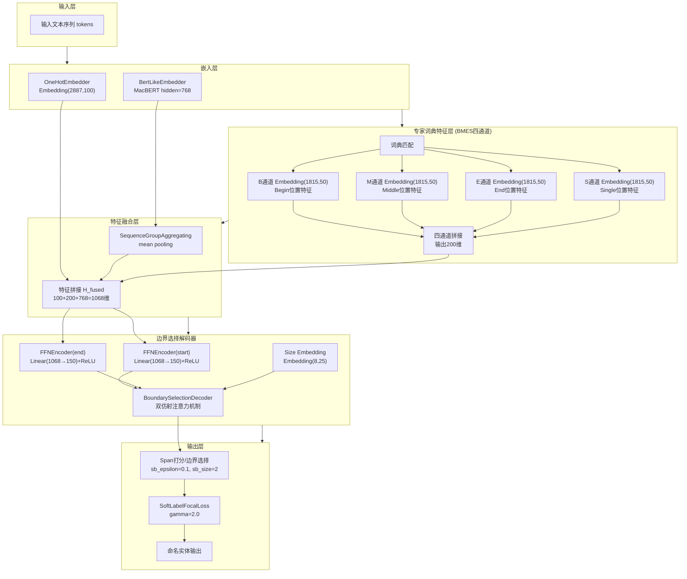
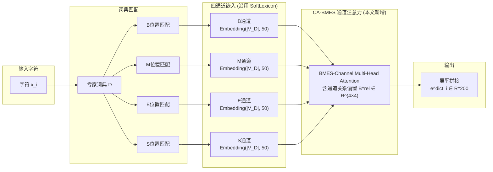
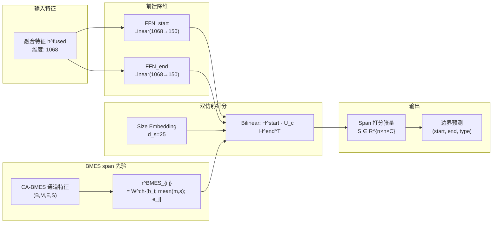

# 1 材料与方法

## 1.1 红枣栽培NER语料构建

选取红枣栽培领域专业书籍作为原始语料，详情信息见表 1。然后将书籍PDF按照正文区域进行裁剪，切除页眉和页脚部分，同时丢弃和红枣栽培知识无关的封面、前言、目录页面，避免冗余文字污染语料内容。随后使用MinerU工具[23]将PDF书籍转化为txt文本格式，人工校对OCR识别过程中出现的字符错误和乱码情况，最终构建红枣栽培NER语料。

表 1 红枣栽培语料信息来源

<table><tr><td>书名</td><td>作者</td><td>出版年份</td><td>字数</td></tr><tr><td>《中国果树志 枣卷》</td><td>王永蕙</td><td>1993</td><td>800k</td></tr><tr><td>《枣丰产技术》</td><td>曹新芳</td><td>2006</td><td>76k</td></tr><tr><td>《果树工 红枣种植》</td><td>刘多红</td><td>2011</td><td>144k</td></tr><tr><td>《红枣优质高效栽培技术》</td><td>单守明</td><td>2021</td><td>114k</td></tr></table>

## 1.2 数据标注及数据集划分

面向红枣栽培知识图谱构建和问答系统服务需求，参考红枣栽培专业书籍和专家知识，围绕红枣栽培关键生产环节，将实体类别细分为14种，各类别信息见表 2。

表 2 红枣栽培数据集（RJND）实体类别

<table><tr><td>实体类别</td><td>实体标签</td><td>实体描述</td><td>实体示例</td><td>实体数量</td></tr><tr><td>品种</td><td>CUL</td><td>红枣品种名称</td><td>牛奶枣、金丝小枣、赞皇大枣</td><td>3056</td></tr><tr><td>产品</td><td>PRO</td><td>红枣加工制品</td><td>鲜食枣果、蜜枣、枣泥</td><td>1025</td></tr><tr><td>部位</td><td>PAD</td><td>红枣树器官与组织部位</td><td>骨干根、丛生发育枝</td><td>7432</td></tr><tr><td>时期</td><td>PER</td><td>生长发育阶段与物候期</td><td>萌芽期、完熟期、落果期</td><td>2192</td></tr><tr><td>分类</td><td>TAX</td><td>植物分类</td><td>落叶乔木、鼠李科、枣属</td><td>104</td></tr><tr><td>营养</td><td>NUT</td><td>营养成分</td><td>维生素C、可溶性糖、膳食纤维</td><td>522</td></tr><tr><td>病害</td><td>DIS</td><td>病害名称</td><td>缩果病、裂果、枣锈病</td><td>1283</td></tr><tr><td>虫害</td><td>PES</td><td>虫害名称与有害生物名称</td><td>枣步曲、桃小食心虫、红蜘蛛</td><td>461</td></tr><tr><td>杂草</td><td>WEE</td><td>田间杂草名称</td><td>田旋花、苦苣、马齿苋</td><td>296</td></tr><tr><td>地理信息</td><td>GEO</td><td>种植区域地名</td><td>新疆南疆地区、辽宁、广西</td><td>1885</td></tr><tr><td>设备</td><td>EQU</td><td>农业设备工具</td><td>播种机、修枝剪、烘干设备</td><td>1896</td></tr><tr><td>肥料</td><td>FER</td><td>肥料名称</td><td>尿素、磷酸铵、磷酸二氢钾</td><td>304</td></tr><tr><td>农药</td><td>DRU</td><td>病虫害防治药剂</td><td>2.5%高效氯氟氰菊酯</td><td>1087</td></tr><tr><td>农艺</td><td>AGR</td><td>栽培管理操作</td><td>嫁接、整形修剪、熏蒸</td><td>3959</td></tr></table>

本研究采用BMES（Begin, Middle, End, Single）方式对上述红枣栽培语料进行实体标注，其中"B"表示实体的开始字符，"M"表示实体的中间字符，"E"表示实体的结束字符，"S"表示由单个字符构成的实体。标注流程采用半自动化策略：首先使用DeepSeek-Chat大语言模型以多线程批处理方式自动提取候选实体词典，并依据词典进行类别匹配，生成初步的BMES标注结果；然后将初步结果导入Label Studio标注平台进行人工校验和修正。

对标注后的红枣栽培数据进行划分，按照8:1:1的比例划分训练集、验证集和测试集。最终RJND数据集切分后训练集包含1527个句子、约18.4万字，验证集包含178个句子、约2.1万字，测试集包含190个句子、约2.3万字，共包含红枣栽培领域25502个实体，平均每句包含约 13.5 个实体。

## 1.3 模型框架

本文提出专家词典边界选择（Expert Dictionary Boundary Selection，EDBS）模型，整体框架如图 1 所示。模型由嵌入层、特征融合层和边界选择解码层组成。

嵌入层并列设置字符级查表嵌入、MacBERT 预训练编码、与按 BMES 四种边界角色匹配领域词典并经 CA-BMES（Channel Attention on BMES）通道交互的专家词典嵌入三条支路，从字符级表面特征、上下文语义与边界先验三个互补视角对字符序列进行多视角表征，以缓解领域罕见字与低频实体边界证据稀疏的问题。

特征融合层将三路嵌入沿特征维拼接为字符级融合表示；边界选择解码层基于双仿射机制对所有候选跨度联合打分，输出 $(start, end, type)$ 形式的实体三元组。  

**图1** 红枣栽培NER模型整体架构

**Fig.1** Overall architecture of the red jujube cultivation NER model

注：模型由三层结构组成：嵌入层（字符级查表嵌入 + MacBERT 预训练嵌入 + 专家词典 BMES 四通道嵌入并列）、特征融合层（三路嵌入按位拼接得到 1068 维融合表示）、边界选择解码层（基于双仿射机制对所有候选跨度联合打分，并以 Soft-Label Focal Loss 作为目标函数）。各模块具体参数设置见 1.4 节。

### 1.3.1 字符级查表嵌入

为获取与上下文无关的领域字符级表征，本文以字符级查表嵌入作为嵌入层的第一条支路。该支路基于可训练嵌入矩阵进行查表。模型在训练集上按字符频次统计构建领域字符表 $\mathcal{V}$，并加入 `<unk>`、`<pad>` 等特殊符号；未登录字符在推断阶段统一映射为 `<unk>`。字符嵌入矩阵 $\mathbf{E}^{c}\in\mathbb{R}^{|\mathcal{V}|\times d_c}$ 随机初始化，并随下游模块端到端联合训练。

给定输入字符序列 $X=\{x_1,x_2,\cdots,x_n\}$，先按字符表将每个字符 $x_i$ 映射为整数索引 $k_i=\mathrm{idx}(x_i)\in\{0,1,\cdots,|\mathcal{V}|-1\}$，并直接以该索引在嵌入矩阵中查表，得到 $x_i$ 的字符级嵌入：

$$
\mathbf{h}^{c}_{i} = \mathbf{E}^{c}[k_i,:]\in\mathbb{R}^{d_c}. \tag{1}
$$

整段序列的字符级查表嵌入矩阵记为：

$$
\mathbf{H}^{c}
=
[\mathbf{h}^{c}_{1};\mathbf{h}^{c}_{2};\cdots;\mathbf{h}^{c}_{n}]
\in\mathbb{R}^{n\times d_c}. \tag{2}
$$

该支路在目标语料上从零学习字符级表征，可为训练集中出现的低频字符与领域专有字符提供独立、可微调的字符级表示通道。与 1.3.2 节得到的预训练上下文嵌入相比，字符级查表嵌入不随上下文动态变化，更侧重稳定的字符表面信息建模。最终，该支路输出的 $\mathbf{H}^{c}$ 将与 MacBERT 上下文表示以及 1.3.3 节的专家词典嵌入并列输入特征融合层。

### 1.3.2 基于 MacBERT 的预训练嵌入

为获取上下文敏感的字符级表示，本文采用 Cui 等[11] 提出的 MacBERT-base 作为嵌入层的第二条支路。该模型针对标准 BERT 在中文处理中的局限性，从掩码粒度、掩码替换策略与片段建模三个方面进行了改进：

**1）全词掩码策略**（Whole Word Masking, WWM）。标准 BERT 在中文上以单字为掩码单位，模型可借助同词内剩余字符进行表面拼合预测，造成语义碎片化。MacBERT 采用 WWM 策略，将同一词语包含的所有字符同时掩码。例如，对"枣锈病"一词，若触发掩码，则"枣""锈""病"三个字同时被替换为 `[MASK]`，迫使模型基于上下文而非局部字符共现完成预测。

**2）MLM as Correction**（MAC）。标准 MLM 任务使用 `[MASK]` 标记替换被掩码 token，导致预训练与微调阶段的输入分布不一致。MacBERT 改用同义词替换策略：对被掩码的字/词，以 80% 概率替换为 Word2Vec 检索得到的同义词（若无可用同义词则回退为随机词），10% 替换为随机词，10% 保持不变，使预训练阶段的输入分布更接近真实文本，从根本上缓解 `[MASK]` 标记引入的预训练–微调不一致问题。

**3）N-gram 掩码策略**。在 WWM 基础上，MacBERT 进一步引入 n-gram 掩码采样：每次触发掩码时，分别以 0.4、0.3、0.2、0.1 的概率选择 1、2、3、4 元词组作为掩码单元，强制模型同时建模字符级与多字片段级的依赖。这对于红枣栽培领域中大量出现的多字专业术语（如"植物生长调节剂""枣锈病防治"）尤为有利。

对于输入的红枣栽培文本序列 $X=\{x_1, x_2, \cdots, x_n\}$，MacBERT 通过 12 层 Transformer 编码器输出每个字符的上下文表示：

$$
\mathbf{H}^{m} = \mathrm{MacBERT}(X) \in \mathbb{R}^{n \times d_h}. \tag{3}
$$

式中 $\mathbf{H}^{m}$ — MacBERT 输出的上下文表示矩阵
      $X$ — 输入文本序列
      $n$ — 序列长度
      $d_h$ — MacBERT 隐藏层维度，本文取 $d_h=768$

MacBERT 输出的上下文表示 $\mathbf{H}^{m}$ 编码了字符在句子层面的语义依赖，与 1.3.1 节的字符级查表嵌入互补，二者将与 1.3.3 节构建的专家词典特征共同送入特征融合层。

### 1.3.3 专家词典特征层

为有效利用红枣栽培领域的专家知识，本文设计专家词典特征层，从训练集自动提取领域实体构建专家词典，并将词典匹配信息融合到字符表示中。该模块在 BMES 四通道编码层面沿用 SoftLexicon[12] 的设计思想，**新增**通道间自适应加权机制——CA-BMES，对 B/M/E/S 四个通道的语义贡献按字符上下文自适应聚合，构成本文的结构改进点。

**1）专家词典构建**

专家词典的构建过程如下：首先遍历训练集中所有标注的实体，提取实体文本及其对应的类别标签；然后按类别组织，构建类别到实体列表的映射；最后对每个类别的实体列表去重，得到最终的专家词典 $D = \{D_1, D_2, \cdots, D_C\}$，其中 $D_c$ 表示第 $c$ 类实体的词典，$C$ 为实体类别数。

**2）Multi-hot 编码**

对于输入序列中的每个字符 $x_i$，根据其在词典匹配中的位置生成 multi-hot 编码向量。具体地，对于每个实体类别 $c$ 和 BMES 位置 $p \in \{B, M, E, S\}$，定义指示函数：

$$
f_{c,p}(x_i) = \begin{cases} 1, & x_i \text{ 在类别 } c \text{ 的词典匹配中处于位置 } p \\ 0, & \text{otherwise} \end{cases} \tag{4}
$$

字符 $x_i$ 的词典指示向量为：

$$
\mathbf{v}^{dict}_i = [f_{1,B}(x_i), f_{1,M}(x_i), f_{1,E}(x_i), f_{1,S}(x_i), \cdots, f_{C,S}(x_i)]^\top \in \mathbb{R}^{4C}. \tag{5}
$$

**3）BMES 四通道嵌入结构（沿用 SoftLexicon）**

与单通道词典特征不同，本文沿用 SoftLexicon[12] 的 BMES 通道分解思路：对 B（Begin）、M（Middle）、E（End）、S（Single）四个位置分别建立独立的嵌入查表通道，每个通道的嵌入维度为 $d_{ch}=50$。对类别集合上的所有匹配实体在通道内进行加权池化（权重由匹配频次归一化得到），得到字符 $x_i$ 在四个位置上的稠密表示 $\mathbf{e}^{B}_i,\mathbf{e}^{M}_i,\mathbf{e}^{E}_i,\mathbf{e}^{S}_i \in \mathbb{R}^{d_{ch}}$，将其按通道维度堆叠：

$$
\mathbf{X}^{ch}_i = [\mathbf{e}^{B}_i; \mathbf{e}^{M}_i; \mathbf{e}^{E}_i; \mathbf{e}^{S}_i]^\top \in \mathbb{R}^{4 \times d_{ch}}. \tag{6}
$$

**4）CA-BMES 通道注意力**

SoftLexicon 在四通道融合阶段对 B/M/E/S 直接做静态拼接，未显式建模通道间的依赖结构。然而 BMES 四通道在语义上存在天然的先验关系：B 通道与 E 通道在同一实体的两端呈强关联，M 通道则与 B/E 通道在内部位置呈中等关联，S 通道独立刻画单字实体。为显式建模上述关系并使通道权重随上下文自适应调整，本文设计 **CA-BMES** 模块，将公式 (6) 得到的 $\mathbf{X}^{ch}_i$ 视为长度为 4、维度为 $d_{ch}$ 的通道序列，应用 $H_a$ 头自注意力。

**通道位置编码**：为区分 B/M/E/S 四个通道的位置语义，在进入注意力前为通道维度叠加一组可学习的位置嵌入 $\mathbf{P}^{ch}\in\mathbb{R}^{4\times d_{ch}}$：

$$
\tilde{\mathbf{X}}^{ch}_i = \mathbf{X}^{ch}_i + \mathbf{P}^{ch}. \tag{7}
$$

各注意力头中查询、键、值的线性投影为：

$$
\mathbf{Q}_h = \tilde{\mathbf{X}}^{ch}_i \mathbf{W}^Q_h, \quad \mathbf{K}_h = \tilde{\mathbf{X}}^{ch}_i \mathbf{W}^K_h, \quad \mathbf{V}_h = \tilde{\mathbf{X}}^{ch}_i \mathbf{W}^V_h, \tag{8}
$$

式中 $\mathbf{W}^Q_h,\mathbf{W}^K_h,\mathbf{W}^V_h \in \mathbb{R}^{d_{ch}\times d_k}$ — 第 $h$ 头的可学习投影矩阵；$d_k=d_{ch}/H_a$ — 单头维度。

**通道关系偏置**：为编码 B/M/E/S 通道间的先验关系结构，在每个头的注意力打分上附加一组可学习的 4×4 偏置矩阵 $\mathbf{B}^{rel}_h\in\mathbb{R}^{4\times 4}$，整体合记为张量 $\mathbf{B}^{rel}\in\mathbb{R}^{H_a\times 4\times 4}$。该偏置以 BMES 语义先验**初始化**（B↔E 双向设为 1.0、M↔{B,E} 双向设为 0.5、S 自环设为 1.0，其余位置为 0），训练中持续优化：

$$
\mathbf{A}_h = \mathrm{softmax}\!\left(\frac{\mathbf{Q}_h \mathbf{K}_h^\top}{\sqrt{d_k}} + \mathbf{B}^{rel}_h\right) \in \mathbb{R}^{4\times 4}. \tag{9}
$$

**残差融合**：将各头输出沿通道维度拼接，经线性投影 $\mathbf{W}^O\in\mathbb{R}^{d_{ch}\times d_{ch}}$ 与可学习残差缩放标量 $\alpha$ 后做残差连接，并在通道维上做层归一化：

$$
\hat{\mathbf{X}}^{ch}_i = \mathrm{LayerNorm}\!\left(\tilde{\mathbf{X}}^{ch}_i + \alpha\cdot \mathrm{Concat}(\mathbf{A}_1\mathbf{V}_1,\cdots,\mathbf{A}_{H_a}\mathbf{V}_{H_a})\,\mathbf{W}^O\right) \in \mathbb{R}^{4 \times d_{ch}}. \tag{10}
$$

本文试验默认采用 $H_a=4$ 头的**完整版** CA-BMES（含通道位置编码、通道关系偏置与残差缩放 $\alpha$）；消融试验中亦报告 $H_a=1$ 的**简化版**（去通道位置编码、$\mathbf{B}^{rel}$ 改为 4×4 共享矩阵并以 $\tanh$ 限幅、不带残差缩放）。

最后将增强后的四通道按通道维度展平拼接，得到字符 $x_i$ 的最终词典特征向量：

$$
\mathbf{e}^{dict}_i = \mathrm{Flatten}(\hat{\mathbf{X}}^{ch}_i) \in \mathbb{R}^{4 d_{ch}} = \mathbb{R}^{200}. \tag{11}
$$

**5）特征融合**

将 1.3.1 节字符级查表嵌入 $\mathbf{h}^{c}_i$、CA-BMES 输出的词典特征 $\mathbf{e}^{dict}_i$ 与 1.3.2 节 MacBERT 上下文表示 $\mathbf{h}^{m}_i$ 按位拼接，并经一个保维线性投影层 $\mathbf{W}^{f}$ 进行融合，得到字符 $x_i$ 的融合表示：

$$
\mathbf{h}^{fused}_i = \mathbf{W}^{f}\,[\mathbf{h}^{c}_i; \mathbf{e}^{dict}_i; \mathbf{h}^{m}_i] + \mathbf{b}^{f} \in \mathbb{R}^{d_f}. \tag{12}
$$

式中 $\mathbf{h}^{c}_i \in \mathbb{R}^{d_c}$ — 字符级查表嵌入向量
      $\mathbf{e}^{dict}_i \in \mathbb{R}^{4d_{ch}}$ — CA-BMES 输出的词典特征
      $\mathbf{h}^{m}_i \in \mathbb{R}^{d_h}$ — MacBERT 末层输出的上下文表示
      $d_f = d_c + 4d_{ch} + d_h$ — 融合特征维度
      $\mathbf{W}^{f},\mathbf{b}^{f}$ — 保维线性投影的权重与偏置

该保维投影在拼接维度上对三路特征做一次线性混合，使字符级表示、上下文语义与词典先验在融合阶段实现非平凡耦合，为下游解码器提供统一的字符级表示。

CA-BMES 模块的优势在于：（1）B/M/E/S 不同位置的语义特征由独立的嵌入矩阵学习，避免参数共享带来的位置信息混淆；（2）通道间多头自注意力与可学习偏置 $\mathbf{B}^{rel}$ 显式建模 B↔E 的边界关联与 M↔B/E 的内部关联，使得 200 维输出的语义结构更紧凑；（3）相比 SoftLexicon 的静态拼接，CA-BMES 使通道权重随字符上下文自适应调整，为下游边界选择解码器提供更精确的位置先验。

**图2 CA-BMES 通道注意力下的 BMES 四通道嵌入结构**

注：图2 展示了 CA-BMES 模块的整体流程。对于输入序列中的每个字符 $x_i$，首先通过专家词典匹配确定其在实体中的位置角色（Begin、Middle、End 或 Single），然后由四个独立嵌入通道（沿用 SoftLexicon 的 BMES 设计）分别学习不同位置的语义特征；本文新增的 CA-BMES 通道注意力以 4 个通道为序列长度，通过多头自注意力与可学习的通道关系偏置 $\mathbf{B}^{rel}$ 显式建模 B/M/E/S 通道间的先验依赖，最终展平拼接得到 200 维的词典特征向量 $\mathbf{e}^{dict}_i$。

### 1.3.4 边界选择解码器

传统 CRF 将 NER 建模为逐字符的序列标注问题，难以直接捕捉实体跨度的全局信息。借鉴 Yu 等[13]提出的将 NER 建模为依存解析的思想，本文提出边界选择（Boundary Selection，BS）解码器，将 NER 建模为 span 分类问题，采用双仿射注意力机制[14]直接预测实体的起止边界及其类型，并将 1.3.3 节 CA-BMES 输出的 BMES 通道特征作为 span 级先验注入打分。

**1）起止位置降维**

对融合特征 $\mathbf{h}^{fused}$ 分别经过两个独立的前馈网络（FFN）做起点与终点的降维投影：

$$
\mathbf{H}^{start} = \mathrm{FFN}_{start}(\mathbf{h}^{fused}) \in \mathbb{R}^{n\times d_r}, \tag{13}
$$

$$
\mathbf{H}^{end} = \mathrm{FFN}_{end}(\mathbf{h}^{fused}) \in \mathbb{R}^{n\times d_r}, \tag{14}
$$

式中 $d_r=150$ — 降维后的隐层维度（$\mathrm{FFN}$ 含 1 层、隐藏维度 150）。

**2）跨度长度嵌入**

对长度为 $j-i+1$ 的跨度 $(i,j)$，引入可学习的尺寸嵌入 $\mathbf{e}^{size}_{i,j}\in\mathbb{R}^{d_s}$，$d_s=25$，用于显式编码跨度长度信息：

$$
\mathbf{e}^{size}_{i,j} = \mathrm{SizeEmbedding}(j-i+1). \tag{15}
$$

**3）BMES 通道 span 级先验**

将 1.3.3 节 CA-BMES 输出的通道特征 $\hat{\mathbf{X}}^{ch}\in\mathbb{R}^{n\times 4\times d_{ch}}$ 按 B/M/E/S 拆为四路 $\mathbf{b},\mathbf{m},\mathbf{e},\mathbf{s}\in\mathbb{R}^{n\times d_{ch}}$。对跨度 $(i,j)$，取起点的 B 通道、终点的 E 通道，以及 $(i+1,\cdots,j-1)$ 区间内 M 与 S 通道的均值（S 通道取均值旨在为多字实体的内部位置引入单字先验的正则化信号），得到 span 级 BMES 表示：

$$
\mathbf{r}^{BMES}_{i,j} = \mathbf{W}^{ch}\,\big[\,\mathbf{b}_i;\; \tfrac{1}{2}(\overline{\mathbf{m}}_{i,j}+\overline{\mathbf{s}}_{i,j});\; \mathbf{e}_j\,\big] \in \mathbb{R}^{d_{ch}}, \tag{16}
$$

式中 $\overline{\mathbf{m}}_{i,j},\overline{\mathbf{s}}_{i,j}$ — M/S 通道在内部区间的平均向量；$\mathbf{W}^{ch}\in\mathbb{R}^{d_{ch}\times 3d_{ch}}$ — 将 BMES 拼接特征压回 $d_{ch}$ 维的可学习投影。

**4）双仿射打分**

跨度 $(i,j)$ 属于类别 $c$ 的得分由三部分相加得到：双线性项、起止–尺寸联合的线性项与 BMES 通道先验项：

$$
s_{i,j,c} = (\mathbf{H}^{start}_i)^\top \mathbf{U}_c \mathbf{H}^{end}_j + \mathbf{w}_c^\top [\mathbf{H}^{start}_i;\mathbf{H}^{end}_j;\mathbf{e}^{size}_{i,j}] + (\mathbf{v}^{BMES}_c)^\top \mathbf{r}^{BMES}_{i,j} + b_c, \tag{17}
$$

式中 $\mathbf{U}_c\in\mathbb{R}^{d_r\times d_r}$ — 类别 $c$ 的双仿射矩阵
      $\mathbf{w}_c\in\mathbb{R}^{2d_r+d_s}$ — 类别 $c$ 的线性权重向量
      $\mathbf{v}^{BMES}_c\in\mathbb{R}^{d_{ch}}$ — 类别 $c$ 的 BMES 先验权重
      $b_c$ — 类别 $c$ 的偏置标量

将所有 span 与所有类别打分组装为三维张量 $\mathbf{S}\in\mathbb{R}^{n\times n\times C}$，作为后续损失计算与解码的输入。

**图3 边界选择解码器结构**

注：图3 展示了边界选择解码器的完整流程。融合特征 $\mathbf{h}^{fused}$ 经两个独立的 FFN 降维后，作为双仿射机制的起止表示；同时将跨度长度嵌入 $\mathbf{e}^{size}_{i,j}$ 与 1.3.3 节 CA-BMES 输出的通道 span 先验 $\mathbf{r}^{BMES}_{i,j}$ 一并融入打分，最终得到三维打分张量 $\mathbf{S}\in\mathbb{R}^{n\times n\times C}$。与 CRF 逐字符标注不同，该方法对实体跨度做全局建模，并将 BMES 通道信息从字符级延伸到 span 级，为长实体边界识别提供更精确的先验。

### 1.3.5 边界平滑 Focal 损失

红枣栽培NER面临类别严重不均衡与标注边界歧义两类典型困难。本文在边界选择解码器中联合引入边界平滑（Boundary Smoothing）与Focal Loss，构成Soft-Label Focal Loss——前者以距离加权软标签替代硬标签，容忍边界标注的±1字符偏移；后者降低高频易分样本的损失权重，缓解类别不均衡。

**1）边界平滑（Boundary Smoothing）**

不同于 vanilla label smoothing 在所有类别上均匀分摊概率，边界平滑[15]仅在真实标注 span 的**邻近 span 邻域**上分摊概率。设真实实体 span 为 $(i^{*},j^{*})$、类别为 $y$、平滑系数为 $\epsilon_{sb}$、邻域半径为 $\Delta$，定义平滑后软标签 $\tilde{y}_{i,j,c}$ 为：

$$
\tilde{y}_{i,j,c} =
\begin{cases}
1-\epsilon_{sb}, & (i,j,c)=(i^{*},j^{*},y) \\[4pt]
\dfrac{\epsilon_{sb}}{\Delta \cdot 4 \cdot d_{i,j}}, & (i,j)\in \mathcal{N}_{\Delta}(i^{*},j^{*}),\, c=y \\[4pt]
0, & \text{otherwise}
\end{cases} \tag{18}
$$

式中 $d_{i,j}=|i-i^{*}|+|j-j^{*}|$ — span $(i,j)$ 到真实 span 的曼哈顿距离；$\mathcal{N}_{\Delta}(i^{*},j^{*})=\{(i,j):0<d_{i,j}\le\Delta\}$ — 真实 span 的曼哈顿邻域；$\epsilon_{sb}$ — 边界平滑系数（本文取 $\epsilon_{sb}=0.1$）；$\Delta$ — 邻域半径（本文取 $\Delta=2$）。平滑概率 $\epsilon_{sb}$ 按距离等额分配至 $\Delta$ 个层级（每层 $\epsilon_{sb}/\Delta$），层内按邻域 span 数均分（距离 $d$ 层约有 $4d$ 个邻域 span），使越远的邻域 span 分得的概率越小，以匹配更近邻域更强的边界标签不确定性。

**2）Focal Loss 聚焦因子**

为缓解大量易分类负样本主导训练的问题，引入聚焦因子 $(1-\hat{p}_{i,j})^{\gamma}$ 对每个 span 的损失重加权，其中 $\hat{p}_{i,j}=\sum_{c}\tilde{y}_{i,j,c}\,p_{i,j,c}$ 为软目标加权的期望预测概率：易分类 span 的 $\hat{p}_{i,j}$ 接近 1，聚焦权重被大幅压低；难分类 span 的权重保留较高。本文取 $\gamma=2.0$。

**3）综合损失函数**

将边界平滑得到的软标签 $\tilde{y}_{i,j,c}$ 与 Focal Loss 聚焦因子结合，得到 **Soft-Label Focal Loss**：

$$
\mathcal{L} = -\sum_{i\le j} (1-\hat{p}_{i,j})^{\gamma} \sum_{c=1}^{C} \tilde{y}_{i,j,c}\,\log p_{i,j,c}, \quad \hat{p}_{i,j} = \sum_{c=1}^{C} \tilde{y}_{i,j,c}\,p_{i,j,c}. \tag{19}
$$

式中 $\mathcal{L}$ — 总损失
      $p_{i,j,c}=\mathrm{softmax}(\mathbf{s}_{i,j,:})_c$ — 公式 (17) 打分经 softmax 归一化得到的预测概率
      $\tilde{y}_{i,j,c}$ — 公式 (18) 定义的边界平滑软标签
      $\hat{p}_{i,j}$ — 软目标加权的期望预测概率
      $\gamma=2.0$ — Focal 聚焦因子

该损失函数同时继承了 Focal Loss 对难分类样本的聚焦能力和边界平滑对标注噪声的正则化效果。

## 1.4 试验环境与参数设置

试验采用的操作系统为 Ubuntu 20.04，GPU 为 GeForce RTX 4090，显存大小 24 GB，CPU 为 Intel(R) Xeon(R) Gold 6248R @ 3.0 GHz，内存 64 GB，Python 版本为 3.8，PyTorch 版本为 1.13.1，CUDA 版本为 11.8。

将最大序列长度设置为 300；预训练模型采用 hfl/chinese-macbert-base，BERT 层学习率为 5×10⁻⁵，其他层学习率为 1×10⁻³；专家词典 BMES 四通道嵌入维度均设置为 50，CA-BMES 通道注意力的多头数为 4；边界选择解码器的起止降维维度为 150，跨度长度嵌入维度为 25；边界平滑系数 $\epsilon_{sb}$ 设为 0.1，邻域半径 $\Delta$ 设为 2，Focal Loss 聚焦因子 $\gamma$ 设为 2.0；EDBS 模型训练轮次为 30 轮、批大小为 16，优化算法选用 AdamW；为保证结果稳定性，每组试验在随机种子 42、43、44 上各运行一次并取平均。

采用精确率（precision，P）、召回率（recall，R）和 F1 值（F1-score，F1）对命名实体识别精度进行评估，实体的边界和类型同时正确才被判定为正确识别。
