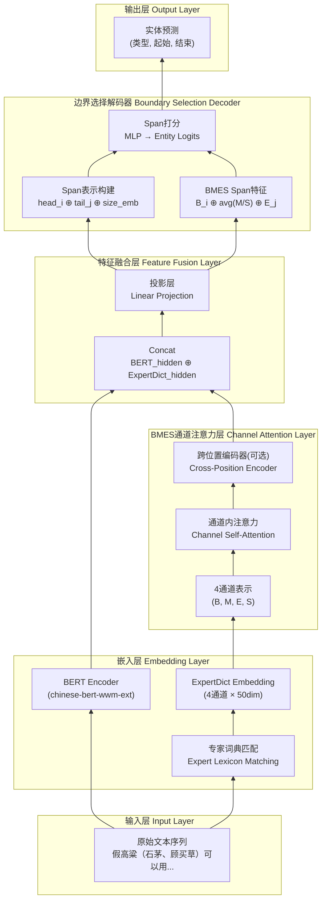

```mermaid
graph BT
    subgraph Input["输入层 Input Layer"]
        TEXT["原始文本序列<br/>假高粱（石茅、顾买草）可以用..."]
    end
    
    subgraph Embedding["嵌入层 Embedding Layer"]
        BERT["BERT Encoder<br/>(chinese-bert-wwm-ext)"]
        LEXICON["专家词典匹配<br/>Expert Lexicon Matching"]
        EMBED["ExpertDict Embedding<br/>(4通道 × 50dim)"]
    end
    
    subgraph BMES["BMES通道注意力层 Channel Attention Layer"]
        CHANNEL["4通道表示<br/>(B, M, E, S)"]
        ATTN["通道内注意力<br/>Channel Self-Attention"]
        CROSS["跨位置编码器(可选)<br/>Cross-Position Encoder"]
    end
    
    subgraph Fusion["特征融合层 Feature Fusion Layer"]
        CONCAT["Concat<br/>BERT_hidden ⊕ ExpertDict_hidden"]
        PROJ["投影层<br/>Linear Projection"]
    end
    
    subgraph Decoder["边界选择解码器 Boundary Selection Decoder"]
        SPAN["Span表示构建<br/>head_i ⊕ tail_j ⊕ size_emb"]
        BMES_FEAT["BMES Span特征<br/>B_i ⊕ avg(M/S) ⊕ E_j"]
        SCORE["Span打分<br/>MLP → Entity Logits"]
    end
    
    subgraph Output["输出层 Output Layer"]
        PRED["实体预测<br/>(类型, 起始, 结束)"]
    end
    
    TEXT --> BERT
    TEXT --> LEXICON
    LEXICON --> EMBED
    BERT --> CONCAT
    EMBED --> CHANNEL
    CHANNEL --> ATTN
    ATTN --> CROSS
    CROSS --> CONCAT
    CONCAT --> PROJ
    PROJ --> SPAN
    PROJ --> BMES_FEAT
    SPAN --> SCORE
    BMES_FEAT --> SCORE
    SCORE --> PRED
```